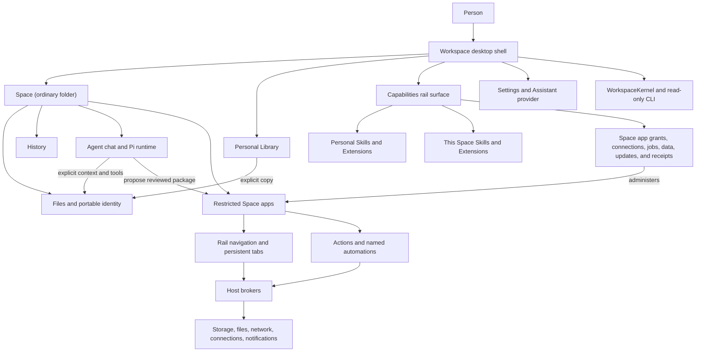
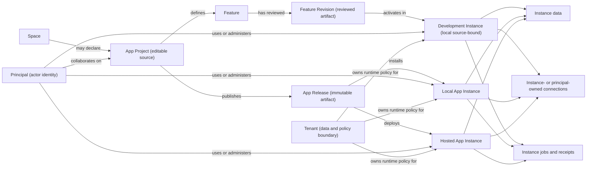
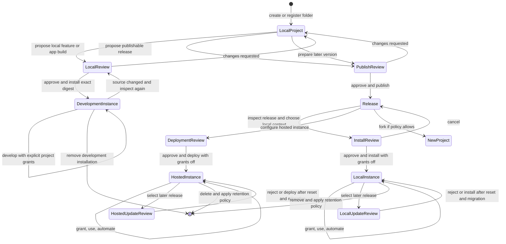

# App platform exploration

> **Status:** Completed exploration; retained as design rationale
>
> **Purpose:** Lay out the existing system and test whether Workspace should evolve from a Space-centered tool into a local-first app studio and runtime.
>
> **Decision:** The Project/Release/Instance direction and Gate 1–4 semantics are
> accepted in [App platform foundation](app-platform-foundation.md). Candidate
> questions and record shapes in this memo remain historical unless carried into
> that contract.

This document deliberately preserves the possibility map that produced the
accepted foundation. It is not a shipped-behavior reference or permission for a
broad rename, folder upload, public marketplace, or generalized sync.

## Working thesis

Workspace already contains most of the pieces of an agent-native app platform:

- an ordinary folder where a person and an agent work together;
- explicit local resources and reusable personal materials;
- an agent harness that can inspect and change the project;
- full-trust Skills and Extensions for the builder/operator;
- reviewed, sandboxed UI and worker code for end users;
- persistent app surfaces in the rail and tab system;
- connections, storage, notifications, automations, and run receipts;
- a local kernel that can describe product state to other agent harnesses.

The open question is not simply whether to rename **Space** to **App**. It is whether the product needs to distinguish an editable local project, a publishable app, an immutable release, each installed or hosted instance, the tenant that owns runtime data, and the authenticated principal performing an action.

The accepted product direction is:

> A Space remains the local, editable working context. A Space may declare an
> optional **App Project** intended to produce an App. Publishing creates an
> immutable **App Release**. Installing or hosting a Release creates an **App
> Instance**. The current restricted Space apps become candidate Features of
> that larger App.

This split preserves ordinary folders and local-first work while giving cloud
publication, collaboration, installation, updates, and multi-user data precise
homes.

## What exists today

| Piece | What it is now | Scope and authority | Possible platform role |
| --- | --- | --- | --- |
| Workspace | Desktop shell and product boundary | One machine and user profile | Studio, local runtime, and management client |
| Space | Human-friendly context backed by one ordinary folder | Registered locally; portable identity metadata lives in the folder | Local project or a broader project container |
| Files | Ordinary user-owned files | One Space; directly interoperable with the filesystem | App source, assets, documents, and explicitly selected publish inputs |
| Chat | Persistent Pi conversation grounded in a Space | One Space and explicit conversation context | Builder, maintainer, and operator workspace |
| Library | Passive reusable personal material | Personal; copied explicitly into a Space | Personal source shelf, templates, and reusable assets |
| Skills | Reusable ways of working loaded by Pi | Personal or Space; executable configuration | Builder/operator capability |
| Extensions | Native Pi executable capabilities and connections | Personal or Space; full trust | Builder/operator capability and development integration |
| Restricted Space app | Reviewed web UI plus optional worker actions | Installed in one Space; sandboxed and digest-pinned | App page, feature, module, or embedded tool |
| Connection | Host-owned credential adapter | Granted to one restricted app | Instance secret or integration binding |
| Automation | Named schedule for a reviewed worker action | Enabled and granted independently per installed app | Local or hosted background job |
| App storage | Bounded host-owned JSON data | One installed restricted app in one Space | Local instance data |
| History | Content-addressed checkpoints around file mutations and agent turns | One Space; excludes executable metadata locations | Project source history, not runtime audit history |
| Settings | Machine-level product and Assistant configuration | Personal; model/provider setup is separate from Space content and app connections | Studio and local-runtime configuration |
| Kernel and CLI | Shared, versioned read model for agents and adapters | Explicit actor and Space resolution; read-only protocol | Local control-plane projection |

## The system as it stands



Two different capability lanes are intentionally present:

1. Skills and Extensions extend the trusted builder/operator agent runtime.
2. Restricted apps provide reviewed, narrowly brokered product features to the person using the Space.

Any future App model should preserve that distinction. A polished page is not a reason to give its code the authority of the agent harness.

## Product rails to preserve

The following are stronger than any noun choice:

1. **Local-first usefulness.** A local project must remain usable without an account or server.
2. **Ordinary folders.** Registering a project must not convert, move, or hide its source.
3. **Explicit publication.** Registration, sync, collaboration, publication, and installation are different acts.
4. **Explicit context.** Neither Library materials nor every project file silently becomes agent context.
5. **Layered authority.** Project trust, package review, app grants, connections, automation enablement, and publication rights remain separate.
6. **Revocation.** Removing a project registration, local grant, connection, collaborator, or installation must stop new brokered effects in the governed runtime before authority can be reused. Release response and disconnected local instances need the more precise online/offline semantics defined below.
7. **Runtime separation.** Full-trust Pi resources and restricted end-user app code stay in different execution lanes.
8. **Provider neutrality.** Cloud storage, model providers, identity providers, and deployment targets remain replaceable adapters.
9. **Understandable ownership.** A person can determine where source, app data, secrets, conversations, and logs live.
10. **Portability without accidental disclosure.** Portable identity metadata is not a publish manifest, and executable project configuration is not public content by default.

## The naming inversion

If a current Space becomes the thing people experience as an App, the existing “restricted Space apps” need a different product role.

| Current concept | Candidate future concept | Why |
| --- | --- | --- |
| Space | App Project or Project | The editable folder-backed source and working context |
| Restricted Space app package | Feature or Page; internally, a Feature Revision/Artifact | Reviewed source/artifact content for one part of the larger experience |
| Rail contribution | App navigation destination | A feature's location inside the app |
| Persistent Space tab | App view or document view | A running view bound to one app instance |
| App proposal | Feature proposal or build output | Agent-created reviewed code awaiting human approval |
| Installed app | Feature; internally, a Feature Installation | A reviewed, digest-pinned component active in an instance |
| App storage | Feature data within an instance | Namespaced runtime data with clear ownership |

“Page” is the simplest user-facing term when the contribution is mostly UI. “Feature” better includes actions and automations. “Module” is precise for builders but weaker for general computer work. **Package** remains valid distribution plumbing but is disqualified as a new user-facing product noun. Internal contracts may use Feature Revision, Artifact, or Installation without teaching those terms to every person. We do not need to choose the final visible noun until the larger object model is settled.

## Three product models

### Model A: Space-first

A Space remains the primary object. Apps stay contained features that can eventually be published or shared.

**Strengths**

- Preserves the current mental model and implementation boundaries.
- Fits folders for research, documents, operations, and other non-app work.
- Requires the least migration and avoids overfitting the whole product to software creation.

**Risks**

- Published experiences may feel secondary or awkwardly nested.
- “Space app” can remain ambiguous: is it the whole experience or a sidebar feature?
- Cloud instances, releases, and end users lack obvious first-class objects.

### Model B: App-first

Every Space becomes an App, and existing restricted apps become pages or features.

**Strengths**

- Gives the product a clear creative outcome: build and run an app.
- Makes publishing, web access, installation, and an eventual catalog easy to explain.
- Aligns the rail, tabs, actions, and automations as one coherent product experience.

**Risks**

- “App” may be too narrow for a folder used for writing, research, client work, or general operations.
- Source, release, instance, and user data can become conflated behind one friendly noun.
- A rename can create false confidence before publication, identity, sync, and tenancy are designed.

### Model C: Project, Release, and Instance

A folder-backed Space may be an App Project. It produces immutable App Releases. Each local installation or hosted deployment is an App Instance.

**Strengths**

- Separates editable source from distributed code and mutable user data.
- Makes update, rollback, fork, collaboration, and hosting semantics explicit.
- Preserves local-first work while supporting web and mobile runtimes later.
- Gives authority a clean target: project roles, publisher roles, and instance roles need not be identical.

**Risks**

- Introduces more concepts and demands careful progressive disclosure.
- Requires an explicit answer for whether every Space is a Project or only some Spaces become App Projects.
- Needs a real release manifest and data model before it improves the product.

### Current leaning

Model C is the strongest architectural hypothesis. It does not require all current Spaces to become apps, and it does not prevent the UI from using the simple word **App** when a person is using a published instance. It also lets the current restricted runtime evolve into an internal feature/page runtime without granting it broader authority.

The important decision is therefore not “Space or App?” in isolation. It is:

> Do we want one object to be source, product, release, installation, collaboration boundary, and data owner—or do we want those responsibilities separated?

## Explored object model



The model should permit a single-person, local-only path with no account while retaining the current restricted-code boundary:

```text
ordinary folder -> Space -> optional App Project -> inspect/review exact bytes -> approve/install -> development instance
```

Cloud objects appear only after an explicit publish, deploy, share, or sync action.

The current baseline is strict: even restricted source inside its owning Space is inspected, digest-pinned, reviewed, and installed before execution. That common dev loop should have a name: a **Development Instance** is a local instance bound to its source App Project and owning Space. It is the one sanctioned overlap between project and instance planes, with rules rather than accidental equivalence: reviewed code still runs in the restricted lane; host-owned storage stays namespaced; access to publish inputs or other project files requires explicit development grants; writes are project mutations with History coverage; and development authority never transfers into a release or another instance.

A Development Instance is different from installing somebody else's immutable
Release. A separate local App Instance owns host-managed runtime state and may
receive explicit ordinary-file resource grants; it does not own, live inside,
or require an App Project folder.

## Identity and binding invariants

Friendly product nouns must not collapse the identifiers that secure the system:

- a portable Space id identifies a local folder-backed context; it is not a credential, a cloud project id, or proof of ownership;
- `projectId` identifies the local App Project and App lineage;
  `cloudProjectId` is a separate authenticated registry binding; Release digest,
  Runtime Instance id, Tenant id, Organization id, and Principal id remain
  distinct;
- copying `.workspace/space.json` must not clone cloud ownership, roles, instance data, connections, or publication authority;
- linking a local project to a cloud project requires an authenticated, revocable binding rather than possession of an object id;
- remote services derive authorization from the authenticated principal and current tenant policy, never from client-supplied scope claims alone;
- a local binding records which cloud project it targets and which Principal
  established it; runtime dispatch and effect records carry the typed
  `AuthorityStamp` domains defined by the accepted foundation;
- folder copy, relink, ownership transfer, account recovery, and organization deletion need explicit collision and recovery rules;
- remote actors cannot reuse current-directory-based Space resolution or the same-user assumptions of the local protocol.

This makes **Tenant** and **Principal** architectural objects even if the UI usually presents friendlier labels such as team, account, or person.

They also have a no-account local form. The machine-local Workspace application profile is the degenerate **local tenant** for host-owned instance state and policy. A sender-bound local UI, worker, Assistant turn, or current-user action receives a host-resolved **local principal**; it is not a cloud identity or reusable credential. The operating-system user boundary and trusted host context supply local coordination, while each broker still validates the owning Space, instance, digest, declaration, and current grants. This does not turn management protocol v1 into an authenticated API. Linking to the cloud creates separate cloud tenant/principal identities and an explicit binding rather than upgrading the local ids in place.

## Publish is not sync

These operations solve different problems and should not share one vague button.

| Operation | Input | Output | Typical authority |
| --- | --- | --- | --- |
| Publish | Reviewed, explicitly selected project material | Immutable release artifact and metadata | Project publisher |
| Deploy | One immutable release plus environment configuration | Hosted instance | Instance creator/admin |
| Install | One immutable release | Local instance | Local user/admin |
| Sync | Mutable state with a declared ownership/conflict model | Replicated project or instance state | Owner/collaborator/user, depending on plane |
| Share | An existing project or instance | Role grant to another identity | Owner/admin |
| Fork | A release or allowed project snapshot | New independently owned project | Recipient plus source policy |
| Update | A newer release | Explicit or policy-approved instance transition | Instance admin |

A release should be content-addressed or otherwise immutable. A hosted instance points at a release and owns its own mutable data, secrets, roles, automation state, and audit trail. Updating an instance changes that pointer through a recorded transition; it does not mutate the historical release.

An update is not only a pointer change. The new bytes and permission maxima must be reviewed before execution; the design must decide which data migrates, which authority is regranted, and which receipts remain visible. The conservative current restricted-app behavior preserves app storage while resetting network, file, and notification grants, connections, every automation, and prior run receipts.

For a multi-feature release, the leading continuity principle is narrower: **feature-revision digest stability**, not the enclosing release digest, is the unit that may qualify for authority continuity. An unchanged feature revision may retain a grant, connection binding, or job only when its relevant permission/declaration digest and target identity are also unchanged, the instance policy permits continuity, and no authority expands. A changed feature resets its authority. This avoids churning every feature when one changes without letting a stable display id smuggle new code or declarations through an update.

A release also needs to be a closed artifact: no ambient local files, mutable dependencies, undeclared downloads, embedded secrets, or deploy-time build steps. Its recorded closure should include runtime API compatibility, dependency inventory, provenance, review attestations, feature and permission declarations, and migrations. Signing and attestation design must cover key rotation and compromise, not only the happy path.

Release response verbs must remain precise. **Delist**, **block new installs**, **block new launches**, **suspend hosted instances**, and **purge an artifact where policy permits** are different actions. An immutable release cannot truthfully be “unpublished” in every sense once copies exist.

## Data and authority planes

Cloud design becomes safer when data is divided by purpose instead of “syncing the Space.”

| Plane | Examples | Default publication or sync posture |
| --- | --- | --- |
| Project source | Selected files, assets, feature source/artifacts, app metadata | Local by default; included only through an explicit publish/sync selection |
| Executable project configuration | `.pi`, Space-scoped Skills and Extensions | Authorized locally by Space registration; never public merely because the app is published |
| Portable project identity | `.workspace/space.json` and related safe identity metadata | May help reconcile a moved local folder; not automatically a cloud app identity or release manifest |
| Conversations | Chat logs, attachments, compaction state | Private and excluded by default; sharing requires a separate product contract |
| History | Local source checkpoints | Local project recovery; not a substitute for release history or runtime audit logs |
| Release artifact | Reviewed app UI, workers, declared features, schemas, and requested capability/permission maxima | Immutable and eligible for distribution only after explicit publication and policy review |
| Instance data | User records, settings, feature state | Bound to one instance and its tenancy model; synced only under an explicit data contract |
| Instance-owned secrets and connections | Shared service accounts, webhook secrets, organization APIs | Never embedded in source or releases; bound to one instance/tenant through a host-owned secret service |
| Principal-owned connections | Per-user OAuth, personal mailboxes, personal storage | Bound to one consenting principal and usable only through that principal's allowed feature/action context |
| Operational state | Schedules, leases, queues, notifications, run receipts | Bound to the executing instance and retained as an auditable control-plane record |
| Library | Personal reusable materials | Never attached to a project, release, or conversation without an explicit copy or selection |

Executable project configuration deserves an additional boundary. Because local Space registration authorizes `.pi` resources to execute with the current user's authority, it must never enter a collaboration or sync stream accidentally. The design must either exclude it or make executable-configuration collaboration a separate, explicit act whose full-user execution consequences are visible.

If today's restricted apps become features inside one larger App, their grants, storage, connections, worker identity, and digests should remain namespaced per feature installation by default. App-level authority must not become ambient authority shared by every feature. Review must also show dangerous permission composition: a feature with both sensitive file access and network access may be able to exfiltrate what it reads even when each grant appears reasonable alone.

Connection ownership changes execution semantics. An instance-owned service credential may support unattended jobs for the tenant. A principal-owned OAuth connection carries that person's consent and must not silently run for another user, survive that principal's removal, or become a shared background credential. Every action and job receipt should identify the connection owner class and effective principal; the design must state whether a principal-owned connection can authorize unattended work and how consent expires or is revoked.

This implies at least three distinct histories:

1. **Project history:** what changed in editable source.
2. **Release history:** what immutable versions were published and by whom.
3. **Runtime history:** what an instance executed, accessed, changed, or notified.

They may link to each other, but they should not be collapsed into one timeline.

The data lifecycle must name more than a generic owner. It should identify the controller, platform processor/operator, instance administrator, tenant, end user or data subject, and third-party source where applicable. The matrix must cover model inputs and outputs, telemetry, logs, caches, backups, support or break-glass access, deleted-account remnants, and audit records, with separate meanings for suspend, disconnect, uninstall, delete, export, backup expiry, and purge.

## Execution placement

The current restricted runtime is a useful local reference architecture. Cloud execution should implement the same product-level declarations and receipts through a separate host adapter, not pretend the Electron sandbox is itself a server runtime.

| Work | Local instance | Hosted instance | Product requirement |
| --- | --- | --- | --- |
| UI | Electron restricted view | Browser/web client | Same declared feature and navigation contract where possible |
| File access | Brokered Space-relative grants | Object/document service or mounted project replica | Exact scope, visible owner, durable receipt |
| Network | Exact reviewed origins and host-owned connections | Egress policy plus instance- or principal-owned connections | No ambient credential or unrestricted network inheritance |
| Storage | Host-owned bounded local store | Tenant-aware data service | Named owner, quota, migration, export, and deletion rules |
| Automations | Shared machine scheduler | Durable cloud scheduler and workers | Same named-job intent; separate leases, retries, limits, and receipts |
| Notifications | Reviewed Windows notifications | Web push, email, mobile, or other adapters | Each destination/category granted separately |
| Agent work | Local Pi harness | Optional hosted agent service | Explicit actor, project context, capabilities, budget, and stop controls |

“Run anywhere” should mean portable declarations and predictable authority, not identical implementation internals.

The current UI is web-shaped, but its meaningful powers are not automatically web-portable. Storage, Space files, network access, connection injection, notifications, navigation/tabs, worker actions, scheduling, and receipts are Electron host brokers today. A hosted runtime needs tenant-aware server implementations behind a deliberately versioned **portable feature-runtime broker API**. That broker contract—not HTML alone—is the central desktop/web portability boundary.

### Portable automation contract

A named job that can move between local and hosted runtimes needs more than the same display name. The portable contract should bind a schedule to an instance id, release digest, and declaration digest, and define:

- cadence anchor, timezone and daylight-saving behavior, bounded catch-up, overlap, ordering, timeout, cancellation, and manual-run behavior;
- duplicate-delivery expectations and idempotency keys without implying exactly-once execution;
- which retry policies are portable and which are host-specific;
- stable receipt states and attempt linkage;
- grant, connection, declaration, release, and authority-generation validation for every attempt;
- update compatibility rules: unchanged jobs preserve schedule state only when explicitly compatible, and expanded authority never carries forward silently.

Cloud leases, retries, split-brain recovery, clock skew, and quota policy are host concerns, but their effects must remain visible through the common receipt model.

The current local host supports at most sixteen interval jobs per feature, intervals from 15 to 1,440 minutes, `none` or `latest` catch-up, `skip` overlap, two machine-wide FIFO execution slots, same-job non-overlap, and execution only while Workspace is running. Those are current local limits and policies, not automatically the cross-runtime contract. Declaration identity, explicit enablement, permission subsets, non-overlap intent, and durable receipt lineage are stronger portability candidates; trigger vocabulary, retry, concurrency, quota, and uptime remain host-specific until deliberately standardized.

## Roles and authority

An App platform needs verbs before it needs a role-name dropdown. The minimum authority matrix should distinguish:

| Actor | Representative verbs |
| --- | --- |
| Project owner | Delete or transfer the project; manage collaborators; set publication policy |
| Project collaborator | Read or change selected source; use builder capabilities according to project policy |
| Reviewer | Approve exact feature bytes, schemas, requested capability declarations, permission maxima, and release contents |
| Publisher | Create an immutable release from an approved project state |
| Instance admin | Deploy/update a release; configure domains, connections, jobs, retention, and user roles |
| Instance user | Use allowed pages/actions and access only their permitted instance data |
| App agent | Act only through explicit project or instance tools, with its own actor identity and receipts |
| Platform operator | Operate infrastructure without silently gaining product-data or project authority |

The reviewer approves declarations and maximum requested authority—never live runtime grants. Installation, each grant, each connection, and each automation enablement remain separate instance decisions.

One person may hold several roles, but the system should record which authority justified each sensitive action. “Owner” must not become a universal bypass for review, secrets, or end-user consent.

### Revocation is a protocol

Revocation cannot be modeled as only a database boolean. The design needs an enforcement matrix for project roles, instance roles, grants, connections, automation enablement, release approval, local/cloud bindings, and support access.

Each sensitive dispatch and each brokered side effect should validate current authority using a monotonic generation or equivalent fencing mechanism. Queued work and retries must not resurrect old grants. In-flight work should be cancelled where possible and denied further brokered effects. Cached sessions and offline clients need bounded lifetimes, explicit revalidation, and an honest revocation-latency promise; a disconnected local installation cannot claim instantaneous remote revocation.

Deleting a local connection record also remains distinct from revoking its credential at the provider. Suspension, uninstall, deletion, export, retention, backup expiry, and final purge likewise need different states and receipts.

## The agent's roles

The Assistant already sits beside the files and can propose restricted features. In an App platform it could occupy four distinct roles:

1. **Builder:** changes project source and proposes features or releases.
2. **Maintainer:** diagnoses a release or prepares an update without silently deploying it.
3. **Operator:** inspects an instance and performs explicitly authorized management actions.
4. **Product feature:** powers an end-user workflow inside the app under restricted tools and data scopes.

Those roles must not inherit one another. An agent allowed to edit local source is not automatically allowed to publish it. An agent inside a hosted feature is not automatically allowed to read project source, Library materials, other users' data, or operator credentials.

## Client surfaces

The likely clients are different views of the same object model, not three separate products:

| Client | Primary job | Likely first-class objects |
| --- | --- | --- |
| Desktop | Build, inspect, run locally, use local files and capabilities | Spaces, App Projects, local instances, Chats, Capabilities, Library, History |
| Web | Use hosted apps, administer instances, collaborate on selected projects | Apps, releases, hosted instances, roles, data, jobs, audit |
| Mobile | Use focused app workflows and receive approved notifications | Hosted instances, user data, actions, notifications |

The web runtime is the most natural first external surface because the current restricted UI is already web-shaped. A mobile store wrapper should come only after hosted identity, tenancy, navigation, offline expectations, and platform review constraints are understood.

## Cloud building blocks

This is a capability map, not a proposed service topology:

1. **Identity and tenancy:** principals, optional organizations, tenant boundaries, roles, sessions, recovery, and ownership transfer.
2. **Project registry:** stable cloud identity linked explicitly to one or more local project identities.
3. **Artifact registry:** immutable releases, digests, provenance, review records, compatibility, and rollback metadata.
4. **Instance control plane:** deploy, update, suspend, delete, domain configuration, quotas, and tenancy.
5. **Data plane:** tenant-, instance-, and user-owned mutable data, schemas, migrations, export, retention, deletion, and conflict rules.
6. **Secret and connection service:** encrypted instance- and principal-owned bindings with narrowly scoped runtime access and consent.
7. **Worker and scheduler plane:** durable queues, leases, concurrency policy, retries, budgets, cancellation, and receipts.
8. **Collaboration service:** project roles, review, change proposals, presence only where useful, and explicit sharing.
9. **Distribution surface:** private sharing, organization catalogs, public listing, discovery, and policy review as separate stages.
10. **Audit and observability:** actor-attributed release, grant, deployment, data, job, and administrative events.
11. **Abuse prevention and incident response:** tenant and principal rate limits, worker and notification quotas, egress reputation controls, anomaly detection, narrowly scoped kill switches, appeal/recovery paths, and audited operator response.

Every remote mutation path also needs authenticated principals, tenant scope, action authorization, freshness and replay protection, idempotency, durable receipts, and auditable service actors. It should extend the management layer's typed actor and scope ideas without treating the current read-only local protocol as a security boundary or mutation transport.

No cloud service should be required merely to create or reopen a local Space.

## Lifecycle to design



The detailed design must cover failure paths: rejected review; partial artifact upload; compromised signing key; malicious approved update; broken or irreversible migration; emergency delisting, launch blocking, or hosted suspension; expired or concurrently disconnected credential; missed, duplicated, or split-brain automation; quota exhaustion; offline edits replayed after role revocation; rollout racing deletion or another rollout; identity outage while instances remain healthy; stale authority restored from backup; deleted owner; organization transfer; billing suspension; orphaned jobs, secrets, domains, backups, or notifications; and unavailable regional runtime.

Migrations are executable authority, not passive metadata. Their design needs schema compatibility rules, backup and fencing behavior, transactional boundaries where possible, explicit approval, and honest rollback limits. Rolling back code after destructive data change may be impossible.

## Fixture checks

### Checked-in Connected inbox

The repository's `examples/packages/restricted-connected-inbox` is the only current app fixture. Its package directory is distribution plumbing; conceptually it maps cleanly as one **Feature Revision**, not yet as the definition of an entire App:

| Current element | Provisional model mapping | Design pressure it exposes |
| --- | --- | --- |
| Owning Space and ordinary package files | App Project source context | Source and local instance ownership are currently the same Space |
| Reviewed package digest | Feature Revision or release-component digest | A future App Release may contain one or several feature digests |
| Advanced local installation from its source Space | Feature Installation in a Development Instance | Review remains strict; installation begins with grants, connections, notifications, and jobs off |
| Rail navigator and persistent tabs | Feature-contributed App navigation and views | The host—not feature code—continues to own instance and tab identity |
| `inbox_search` worker action | Instance-scoped feature action | An Assistant-visible tool does not imply background or end-user authority |
| `mail-api` and `project-service` declarations | Requested network permission maxima | Exact grants remain instance decisions; a hosted mail connection still needs an explicit instance-owned versus principal-owned classification |
| `exports` directory declaration | Requested local-context file maximum | A hosted instance needs an explicit object/document-store analogue rather than an assumed filesystem |
| Host-owned JSON storage | Namespaced feature data inside the instance | Updates need schema, migration, quota, export, and retention rules |
| `refresh-inbox` interval job | Named instance job bound to feature/release declarations | The current 30-minute, latest-catch-up, skip-overlap policy tests the portable-job hypothesis |
| Static completion notification | Separately granted notification category | Desktop, web, email, and mobile delivery remain destination adapters, not ambient permission |
| Optional numeric-loopback demo service | Local development/runtime dependency | It is not portable to hosted execution until represented as an owned service contract or removed from the release |

The fixture supports two possible products: a broader App Project that contains “Connected inbox” as one feature, or a standalone inbox App whose release contains that single feature. That ambiguity is useful evidence for Gate 1; it should not be hidden with a rename.

### Deliberately non-coding fixture

Use a **community garden coordinator** on paper before implementation. Its ordinary folder contains plot plans, vendor quotes, meeting notes, photos, and printable schedules. Optional App features provide a member roster, watering calendar, supply requests, and a weekly reminder job. Personal Library templates enter only by explicit copy. A private hosted instance lets coordinators and members see different data and actions while the local folder remains useful without an account.

This fixture tests whether the model supports documents as primary material, local-only work, multiple roles, shared versus user-private data, approved notifications, and a boring automation without turning the product into an IDE or treating every file as database state.

## Decision gates before implementation

### Gate 1: nouns and identity

- Is every Space potentially an App Project, or is “make this an app” an explicit transition?
- Is the user-facing app identity the project, a release lineage, or an instance?
- What remains true when the local folder moves, is copied, or is deleted?
- How do the degenerate local tenant/principal map to cloud identities without making an account necessary for local work?

### Gate 2: publication boundary

- Which files and declarations can enter a release?
- How are feature review, requested capability/permission declarations, provenance, and digests represented?
- Can a release depend on Skills or Extensions, and if so, where do those execute?
- How does the build prove artifact closure, dependency integrity, runtime compatibility, and signing provenance?
- Is feature-revision digest plus unchanged declaration/target identity the unit of grant, connection, and job continuity across a multi-feature release update?

### Gate 3: mutable data and sync

- Which data belongs to the project, instance, tenant, or individual user?
- Which source and data types support sync, and what is their conflict model?
- What are export, backup, retention, deletion, and regional requirements?
- Is executable project configuration excluded from collaboration, or enrolled through a separate full-trust act?
- Which project/instance overlap is permitted only inside a Development Instance, and how are publish inputs protected from granted file writes?

### Gate 4: runtime and authority

- Which workloads may run locally, in Workspace's cloud, or on a user-selected host?
- How do grants, connections, automation enablement, budgets, and receipts project across runtimes?
- How are revocation and release rollback enforced against already running work?
- What generation, fencing, revalidation, retry, and offline-expiry rules prevent stale authority from producing effects?
- Which connections are tenant/instance-owned versus principal-owned, and what actor and consent can authorize their unattended use?
- What portable broker API gives desktop and hosted features equivalent bounded powers without pretending their hosts are identical?

### Gate 5: clients and distribution

- Is the first remote milestone private web deployment, collaboration, or a public catalog?
- Which app navigation and feature contracts must be portable across desktop and web?
- What is intentionally unavailable on mobile?

### Gate 6: migration and product language

- Does the existing example Space become an App Project, and do its restricted apps become features?
- Which current internal identifiers can remain stable even if user-facing nouns change?
- Can the simple local workflow stay simple while advanced release and instance concepts appear only when needed?

No product-bound hosted runtime or server prototype should begin until Gates 1 through 4 have explicit decisions. No broad rename or manifest migration should begin until the relevant client, migration, and language decisions in Gates 5 and 6 are also accepted.

Explicitly throwaway distributed-systems spikes may inform Gates 3 and 4 when paper reasoning cannot validate clocks, leases, fencing, retry, or offline expiry. A spike must use no production or personal data, make no persistence or compatibility promise, avoid product integration, remain unmerged and unshipped, record the question and result, and be destroyed after the evidence is captured. It is an experiment, not an early foundation.

## Planning sequence

### Phase 1: ontology

Write the one-page definitions and ownership rules for Space, App Project, Feature, Feature Revision, Feature Installation, Development Instance, App Release, App Instance, Principal, and Tenant. Define the degenerate no-account local tenant/principal explicitly. Treat an Organization as one possible principal/tenant shape rather than committing the first milestone to a team or B2B account model.

Run every proposed noun through the existing [Decision test](product-model.md#decision-test): explain why it cannot fit cleanly inside the current concepts, make its scope and authority understandable, preserve ordinary folders and Pi compatibility, and prove that it still works for non-coding computer work. A noun that fails the test remains internal architecture or disappears.

### Phase 2: journeys

Storyboard at least these end-to-end journeys:

1. Create or register an ordinary non-App Space and use its Chats, Library copies, History, and Personal/This Space capabilities indefinitely without an account or conversion.
2. Build, review, install, and run a private Development Instance in its source Space without an account, including an explicit grant that can touch a publish input.
3. Publish a local project as a private hosted app.
4. Invite a collaborator to change selected project source without exposing instance secrets or automatically sharing executable `.pi` configuration.
5. Install somebody else's release into a chosen local context, grant one connection, and enable one automation.
6. Publish a multi-feature update where only one feature revision changes; review its new bytes and permission maxima; verify continuity or reset for each feature's grants, connections, jobs, data, and receipts; then roll it out or roll it back where safe.
7. Fork an allowed app into a new independently owned local project.
8. Revoke a collaborator, connection, automation, or instance; separately delist a release, block future installation/launch, or suspend hosted instances.
9. Move or copy the same portable Space identity across machines and explicitly choose relink versus fork.
10. Use one hosted instance with multiple principals and test shared, tenant-isolated, and user-isolated data plus one shared service-account connection and separate per-user OAuth connections.
11. Withdraw cloud access or block future release launches while a local instance is offline, then reconnect and observe the documented result.

### Phase 3: trust and data

Produce a data classification, authority and revocation matrices, threat model, deletion/export contract, portable automation contract, and lifecycle definitions for release response and instance deletion. Model local, hosted, and hybrid execution separately.

### Phase 4: architecture options

Compare cloud shapes only after the product model is stable. At minimum compare a Workspace-operated control/data plane, deployable user-owned runtimes, and a hybrid. Define adapter boundaries before choosing vendors.

### Phase 5: paper contract

Draft, without wiring it into the product:

- an App Project declaration;
- an immutable release manifest;
- feature/page declarations;
- requested runtime capabilities;
- a versioned portable feature-runtime broker API covering identity/context, navigation and views, storage, file/object access, network, instance- and principal-owned connections, notifications, actions, jobs, receipts, errors, cancellation, and quotas;
- instance configuration and role records;
- job declarations and receipts;
- versioning and migration rules.

Validate the contract against the existing example app and one deliberately different non-coding app.

### Phase 6: thin vertical prototype

Only after the earlier decisions, build the narrowest proof:

> publish one reviewed local project to one private hosted web instance, separately grant one declared destination, bind one explicit connection, enable and run one named automation, show its receipt, review an update's authority transition, and revoke access.

The prototype should prove identity, authority, artifact immutability, instance data ownership, and revocation. A broad marketplace or generalized real-time sync would hide those risks rather than test them.

## Near-term recommendations

1. Keep current shipped terminology and manifests stable while this exploration is open.
2. Treat **Project / Release / Instance** as the leading model to test, not a settled rename.
3. Regard the current restricted-app system as a candidate **feature/page runtime** inside a larger app.
4. Design the publication artifact before designing folder sync.
5. Make private hosted web deployment the likely first remote target.
6. Test a portable named-job core for identity, authority, scheduling intent, and receipt lineage while keeping trigger limits, retry, concurrency, quota, and uptime policy host-specific.
7. Use the current example app as a migration fixture, then add one non-coding fixture to prevent app-builder tunnel vision.
8. Preserve the Space abstraction internally until a migration produces more clarity than churn.
9. Model the source-bound Development Instance explicitly and keep Package as internal distribution plumbing rather than a new visible noun.

## What not to do yet

- Do not rename every Space to App in the UI or codebase.
- Do not upload whole Space folders as the definition of publishing.
- Do not merge `.workspace` portable identity, `.pi` executable configuration, Chats, Library, secrets, and app data into one sync stream.
- Do not collapse full-trust Skills/Extensions into the restricted feature runtime.
- Do not make the existing read-only management protocol a cloud mutation API.
- Do not treat a source collaborator as an instance administrator or end-user data reader.
- Do not build an App Store before private release, installation, update, revocation, and deletion work end to end.
- Do not make an account a prerequisite for local projects.
- Do not let a distributed-systems research spike create a durable schema, product dependency, merge-ready service, or implicit implementation commitment.

## Open questions

### Product

- Is an App a new kind of Space, a mode a Space enters, or the published output of a Space?
- Does Workspace remain the studio name while each published experience has its own identity?
- Are pages/features visible as concepts to end users, or only to builders?
- What kinds of non-coding Apps must feel first-class?

### Collaboration

- Is collaboration source synchronization, agent-mediated proposals, real-time co-editing, or a deliberate sequence of these?
- Can collaborators bring personal Skills and Extensions without changing the shared project contract?
- What review is required before collaborator changes become a release?

### Runtime

- Which APIs form the portable restricted runtime across desktop and web?
- How do long-running services differ from named scheduled actions?
- How are cost, quota, concurrency, retry, cancellation, and abuse controls explained to an App owner?

### Distribution

- Are releases private by default, organization-visible, unlisted, or public?
- What does “install” mean on desktop versus “open” on the web?
- Which provenance, review, support, privacy, and moderation evidence must accompany a public listing?

### Business and operations

- Who pays for hosted compute, storage, network use, model calls, and notifications?
- Can an App owner choose a different runtime provider or self-host later?
- What availability, backup, incident response, and data-processing promises are acceptable for the first hosted milestone?

## Exit criteria for exploration

This exploration is ready to become normative product architecture only when:

- the core nouns fit both current Workspace behavior and the target hosted experience;
- publication contents and exclusions are explicit;
- source, release, instance data, secrets, conversations, and receipts each have an owner;
- project, release, instance, tenant, and principal identities and bindings are specified;
- multi-feature update continuity and instance-owned versus principal-owned connection behavior are specified;
- the portable feature-runtime broker contract covers every meaningful desktop power and its hosted authority boundary;
- abuse prevention, emergency response, and operator access are constrained and auditable;
- local and hosted authority/revocation behavior is enforceable for queued, running, retried, cached, and offline work;
- the key journeys work on paper without hidden account or sync assumptions;
- the existing example app maps cleanly into the proposed model;
- at least one non-coding app maps cleanly too;
- accepted decisions are moved into the product model, runtime/authoring docs, management guide, security/privacy docs, and architecture decision records before implementation.
