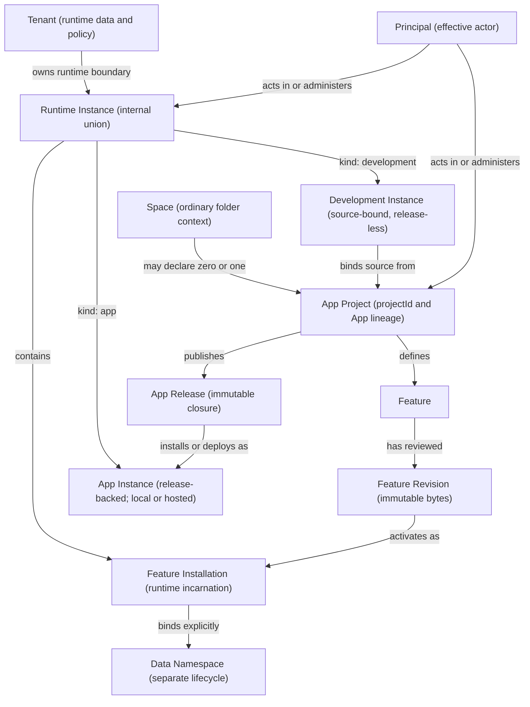

# App platform foundation

> **Status:** Accepted product and architecture direction; local foundation
> implemented, private hosted semantic core proven
>
> **Scope:** This document is the normative foundation for evolving restricted
> Space apps into a local-first App platform. It fixes the product objects,
> ownership boundaries, authority invariants, and implementation order. It does
> not claim that cloud publication, a hosted product, or every candidate wire
> record is shipped.

Workspace is both a local studio and a runtime surface. A person and the
Assistant work in an ordinary folder-backed Space, may explicitly declare an App
Project there, and may build reviewed Features that contribute pages, actions,
data, connections, and named automations. Publication closes selected reviewed
material into an immutable App Release. A release can then be installed locally
or deployed privately as an App Instance without uploading or converting the
source Space.

This direction resolves the original “should Spaces be Apps?” question by
keeping the useful distinction:

- a **Space** is the general local working context and may never become an App;
- an **App Project** is an optional source-and-publication role declared by one
  Space;
- a **Feature** is one stable contribution to that Project, such as the current
  reviewed sidebar app;
- an **App Release** is immutable reviewed distribution content; and
- an **App Instance** is one release-backed local installation or hosted
  deployment with mutable data and authority.

## Canonical object model

`Runtime Instance` is internal contract language, not a third product object. It
is a discriminated union with one opaque `runtimeInstanceId` namespace:

- `kind: development` is local, bound to one Space and App Project, and has no
  App Release;
- `kind: app` has one App Release and a separate `host: local | hosted`
  placement; and
- kind never changes in place. Publishing and installation create new objects
  and receipts rather than converting a Development Instance.

The complete definitions and journey tests live in
[App platform ontology](app-platform-ontology.md).

## Fixed product and security decisions

1. **Ordinary folders remain the source of truth.** Declaring an App Project
   does not convert, move, upload, or make a Space proprietary. A local App
   Instance does not need to own or live inside a project folder.
2. **Project and runtime ownership are separate.** `projectId` is the local App
   lineage across Releases. An optional `cloudProjectId` is an authenticated
   registry binding. A Principal or optional Organization owns the project-role
   realm. A Tenant owns runtime policy and data, never project source.
3. **Identity never authorizes by possession.** The trusted host derives Space,
   Project, Tenant, Runtime Instance, Feature Installation, Data Namespace, and
   effective Principal context. A renderer, worker, client, or copied manifest
   cannot choose its authority scope.
4. **Review, publication, installation, and authority remain separate acts.** A
   declaration requests a maximum. Installation starts destinations, resources,
   notifications, connections, and every named automation off.
5. **Immutable bytes and live policy remain separate.** The App Release digest
   covers its closed executable and evidence graph. Review, signature, scan,
   registry, delisting, block-launch, and incident records are append-only
   attestations or mutable policy sidecars over that digest. Hosts evaluate both
   closure and current sidecars at publish, install/deploy, launch/activation,
   and authority-lease boundaries.
6. **Installation incarnation and data lineage are different identities.** A
   reviewed update preserves `featureInstallationId`; remove/reinstall creates a
   new value. Mutable data uses `dataNamespaceId`, which can be retained,
   migrated, adopted, exported, or purged only through an explicit receipted
   lifecycle action and is never revived implicitly.
7. **Authority is durably fenced by domain.** Dispatches and effects carry one
   typed `AuthorityStamp` with runtime-instance, feature-installation, grant,
   connection, job, principal, and data generations. Authoritative brokers
   recheck the relevant current fields immediately before effects and commits;
   cancellation alone is insufficient.
8. **Runtime access policy is host-enforced.** Principal-private and role-shared
   data collections and role-bound actions are checked from the host-resolved
   Principal and current roles at operation and commit boundaries. UI hints and
   Feature JavaScript never authorize them.
9. **Connection ownership is explicit.** Instance-owned service connections and
   Principal-owned personal connections have distinct consent, unattended-use,
   transfer, deletion, and receipt rules. Tenant transfer fences all use,
   disconnects instance connections by default, and never transfers Principal
   connections.
10. **Migrations are a restricted management invocation.** Exact reviewed
    migration and schema digests receive enumerated namespace access, fencing,
    cancellation, and receipts. They inherit no view, action, job, network,
    connection, or notification power by default and preserve Principal-private
    partitions.
11. **Publish is not sync.** Publication, project collaboration, instance-data
    replication, secrets, operational control, and Chat sharing are separate
    protocols. Workspace-owned streams exclude `.pi/`, Chats, raw portable
    identity, Library storage, History internals, credentials, and machine
    state. Third-party folder tools may still copy ordinary hidden content under
    their own settings.
12. **Every accepted effect has one effective Principal.** Human, agent,
    service, and system are the Principal kinds. Feature code is identified by
    Feature Installation and Revision, not as another Principal. Receipts may
    add a delegation or authorizer and bounded non-secret effect attribution.
13. **The runtime broker is semantic, not transport-shaped.** Desktop Electron
    and hosted web adapters implement the same identity, authority, error,
    cancellation, receipt, storage, resource, network, connection, action, job,
    notification, and migration semantics. Electron IPC and a hosted API are
    adapters, not the product contract.
14. **Management remains a separate authenticated plane.** Feature runtime code
    cannot publish, install, approve bytes, grant a power, save a connection,
    enable a job, assign a role, migrate data, or deploy an instance. The current
    same-user CLI protocol remains read-only.

The detailed publication/data rules and candidate records live in
[App platform publication and data contracts](app-platform-publication-data.md).
The portable broker semantics live in
[App platform runtime contract](app-platform-runtime-contract.md).

## Product language

The friendly surface uses **Space** while a person works locally and the App's
own name while they use an installed or hosted experience. **App Project**,
**Release**, and **Instance** appear only where build, publish, update,
environment, ownership, or recovery decisions require precision. **Feature** is
builder/admin language; its meaningful contributed page or action name is
primary for end users. **Runtime Instance**, **Feature Installation**, **Data
Namespace**, **Tenant**, **Principal**, governance enums, and **Package** remain
internal or advanced diagnostic language.

Current restricted Space-app terminology remains accurate for the version-2
`agent-app.json` UI and package contract until a reviewed product migration
lands. The new model is carried behind that surface; it is not permission for a
broad rename.

## Implementation order

The first implementation milestone is local and additive:

1. add cross-implementation canonical declaration and artifact digest fixtures;
2. add transport-neutral opaque identifiers, Runtime Instance context,
   `AuthorityStamp`, stable errors, and receipt types alongside current records;
3. migrate the local registry to explicit Development Instance, Feature
   Installation, Data Namespace, and durable generation records without losing
   the example App's state;
4. separate artifact storage, installation records, authority resolution,
   connection records, receipts, scheduling coordination, and runtime adapters
   behind the existing narrow brokers;
5. migrate storage, connections, schedules, and receipts to the new identities
   with effect-time fencing and owner-class rules; and
6. add an offline release assembler/verifier plus atomic local App Instance
   install/update planning before any server becomes authoritative.

The first hosted milestone is deliberately private and narrow:

> Publish one reviewed local App Project to one private hosted App Instance,
> separately grant one declared destination, bind one explicit connection,
> enable and run one named automation, show its receipt, review an update's
> authority transition, and revoke access.

It requires authenticated Principals, separate Project and Tenant role realms,
an immutable artifact registry, one hosted data/secret service, the semantic
broker adapter, durable scheduling with leases and fencing, and a bounded audit
projection. It does not require generalized folder sync, public discovery, an
App Store, mobile packaging, arbitrary long-running services, or exactly-once
jobs.

### Implemented foundation boundary

The local milestone above is implemented behind the current restricted-app
surface. It includes language-neutral declaration and artifact vectors checked
by two code-independent executables, strict opaque identities and seven-domain
authority, registry migration to Project/Development Instance/installation/data
records, effect-time host fencing, restart-retried cleanup, authority-captured
receipts, an offline immutable Release assembler/verifier, and a deterministic
local App Instance update planner. The desktop does not yet expose Release
publication or App Instance installation UI.

The private hosted journey is implemented as an executable semantic core with
injected durable compare-and-swap state, scheduler/lease, vault, and egress
contracts. Its tests cover separate Project/cloud-Project and Tenant roles,
review and publication, deployment, default-off grants, an exact instance-owned
connection, a named job and receipt, compatible update, effect-time revocation,
role/principal/instance data, export, delete, purge, restart, and cleanup
recovery using Connected inbox and community-garden fixtures. It is not a
deployed Workspace service. Production database, scheduler worker, secret
vault, egress, authenticated transport, deployment, operations, and UI adapters
remain future work; this first slice also rejects Feature-set, schema, or data
policy migrations instead of pretending to support them.

## Evidence gates

The four semantic paper gates are accepted as the design contract. The required
lease, cadence/clock, and offline-expiry experiments have also passed; see
[App platform runtime spike evidence](app-platform-runtime-spike-evidence.md)
for the demonstrated invariants and honest limits.

- **Gate 1:** ontology, identities, ownership, local no-account forms, and the
  eleven journeys;
- **Gate 2:** publication closure, provenance, review/publication separation,
  per-Feature continuity, and response states;
- **Gate 3:** data owner classes, connections, Development Instance writes,
  migrations, retention/export/deletion, and explicit non-sync boundaries; and
- **Gate 4:** portable broker authority, receipts, scheduling, revocation,
  offline leases, abuse controls, operator boundaries, and host adapters.

Their acceptance criteria gate the product scope that depends on them; they are
not a claim that every future-hosting criterion shipped in the local foundation
release. The local milestone requires canonical digest conformance, explicit
identity migration, effect-time stale-authority tests, offline Release and
migration planning, restart-safe cleanup, bounded receipts, the Connected inbox
and community-garden subsets, and the disposable lease/clock/offline-expiry
evidence. A production hosted product additionally requires the still-open
Principal-owned connection/delegation, migration execution, Development
publish-input commit, restore/tombstone, retention/region/operator, shared-host
conformance, and real durable-adapter evidence listed in the supporting gates.
No public listing, generalized sync, or hosted-product claim may outrun those
criteria.

## Compatibility posture

Workspace is unreleased and the checked-in example is the only existing Space
app, so preserving an accidental internal schema is not a product goal. We may
replace registry and manifest internals when that materially improves the
model. We still require an explicit migration for the example and fail-closed
handling because those are the same mechanics future user data will depend on;
we do not carry forward confusing concepts merely for compatibility theater.
