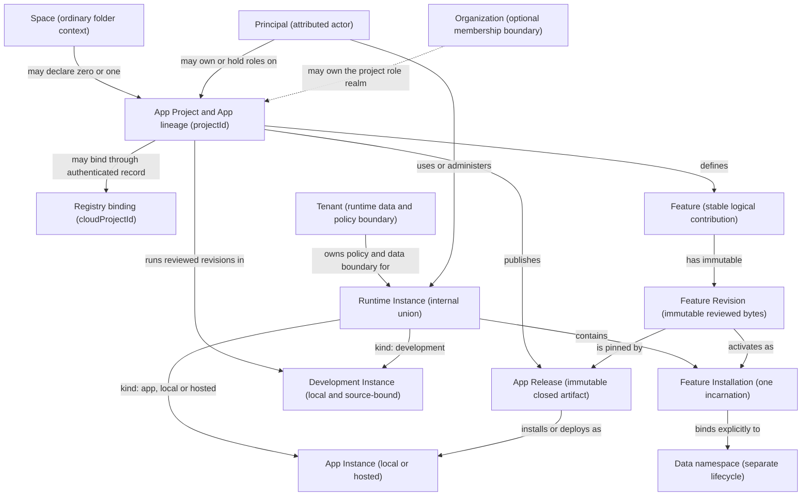

# App platform ontology

> **Status:** Accepted Gate 1 supporting contract
>
> **Purpose:** Define the precise vocabulary and ownership rules accepted by
> [App platform foundation](app-platform-foundation.md). Most terms remain
> internal or builder-facing and do not broadly rename the shipped UI.
>
> **Authority:** [Product model](product-model.md) and
> [App platform foundation](app-platform-foundation.md) are normative. This
> document is their accepted detailed definition set; versioned code remains
> authoritative for exact persisted formats.

## Gate 1 conclusion

The ontology can preserve **Space** as the general local-first object while
adding a precise App lifecycle only when a person chooses to build or publish
one. The leading model is:

> A Space may declare one App Project whose identity is the friendly App lineage.
> The project defines Features and reviewed Feature Revisions. An internal
> Runtime Instance is either a release-less, source-bound Development Instance
> or a release-backed local/hosted App Instance. Each Runtime Instance belongs to
> a Tenant, while project ownership remains a separate Principal/Organization
> role realm. Every action is attributed to a Principal; executing Feature code
> is represented by its Feature Installation, not by inventing another Principal.

This gives the friendly word **App** a coherent surface meaning without making
one identifier stand for source, immutable code, a running copy, a data owner,
and an actor. It also leaves ordinary, non-App Spaces completely valid.

Gate 1 originally resolved the ontology before implementation. The normative
foundation now authorizes only its explicitly scoped local records and semantic
evidence; it still does not authorize a broad rename or imply a server product.

## Relationship map

The map separates the source path, immutable distribution path, runtime path,
project-ownership realm, and Tenant runtime boundary. The current restricted
Space app fits as a Feature Revision installed in a Development Instance; it is
not forced to define the whole App.

## Definitions

### Space

A **Space** is the existing human-friendly context backed by one ordinary
folder. Registration adds narrow portable identity and Chat records without
moving, converting, or making the folder cloud-owned. A Space may remain useful
forever without an account, App Project, release, or instance.

- **Identity:** its portable Space id identifies the folder-backed context. It
  is not a credential, cloud project id, or ownership proof.
- **Control:** the person controls the ordinary folder through the filesystem;
  the local Workspace profile controls whether it is registered and authorized
  to load its project Pi configuration.
- **Authority:** registration authorizes local Pi configuration for Workspace.
  It does not publish, share, install a Feature, grant a connection, or attach
  all files to a Chat.
- **Copy behavior:** moving the folder may preserve identity. Copying it creates
  a collision that requires an explicit relink-or-fork decision before any
  remote binding can be used.
- **Visibility:** always user-facing. It remains the primary general-work noun.

### App Project

An **App Project** is an explicit, additive role declared by a Space: this Space
is intended to define and publish one App lineage. It is not a new container, an
irreversible conversion, or permission to upload the folder. Gate 1 limits the
first contract to zero or one App Project per Space; a future need for several
independent Apps should use separate Spaces unless evidence justifies more
complexity.

- **Identity:** `projectId` is the stable identity of both the App Project and the
  friendly App lineage across its Releases. It is distinct from the Space id.
  There is no second release-lineage identity. A remote registry creates its own
  `cloudProjectId` and an authenticated binding to `projectId`; that registry id
  never replaces the project identity.
- **Control:** local source remains controlled through the Space folder. Remote
  collaboration and publication use a separate project-role realm owned by a
  Principal or optional Organization. A Tenant never owns an App Project.
- **Authority:** project edit, review, and publish are different verbs. Project
  access never implies instance administration, end-user data access, or secret
  access.
- **Copy behavior:** copying source may create a new local project lineage, but
  cannot copy cloud ownership or publication authority.
- **Visibility:** contextual in builder and publishing flows. A person using a
  normal Space should not need to learn it.

The user-facing **App** identity is `projectId` carried through the project's
Releases. A running copy is still a distinct App Instance. Contracts and
security-sensitive UI must use the exact object rather than rely on the
overloaded word “App.”

### Feature

A **Feature** is one stable, project-scoped logical contribution to an App. It
may contribute navigation, views, actions, jobs, data schemas, and requested
broker capabilities. “Connected inbox” is a Feature whether it is the only
Feature in an App or one among several.

- **Identity:** a stable Feature id is unique within its App Project lineage.
  Display names and routes are not identity.
- **Control:** project editors may change Feature source; reviewers approve exact
  revisions and requested authority maxima.
- **Authority:** the Feature declaration requests a maximum. It receives no live
  runtime grant merely by existing in source or a release.
- **Lifecycle:** the stable Feature survives revision changes. Removal from a
  Release does not silently delete retained Runtime Instance data; the data
  lifecycle must decide that separately.
- **Visibility:** likely visible to builders and administrators. End users may
  see its meaningful name or navigation contribution without seeing the generic
  noun “Feature.” The final surface label remains a language-design question.

### Feature Revision

A **Feature Revision** is an immutable, content-addressed set of reviewed Feature
bytes plus its relevant declarations, schemas, and compatibility metadata. It is
the exact executable unit, not a mutable source directory or display version.

- **Identity:** the content digest identifies exact bytes. The revision record
  also binds the stable Feature id, declaration digest, runtime API
  compatibility, and provenance.
- **Control:** a reviewer can attest to a revision; neither author nor reviewer
  thereby grants it runtime authority.
- **Authority continuity:** unchanged revision bytes may qualify for continuity
  only when relevant declaration/permission identity and target identity are
  also unchanged, Runtime Instance policy permits it, and authority does not
  expand.
- **Lifecycle:** revisions are immutable. A change creates another revision.
- **Visibility:** internal architecture surfaced as exact-version and review
  evidence where needed; not a primary navigation noun.

### Feature Installation

A **Feature Installation** is one activation incarnation of a stable Feature in
one Runtime Instance. It has an opaque `featureInstallationId` that remains
stable across reviewed revision updates. Removing and later reinstalling the
Feature creates a new id; an old installation identity is never revived.

- **Ownership:** the containing Runtime Instance owns the installation, current
  grants, connection bindings, job state, and receipts.
- **Data binding:** mutable Feature data has a separate opaque
  `dataNamespaceId`. Update may retain that binding after compatibility or
  migration review. Removal must explicitly retain, export, or purge it. A later
  installation may adopt retained data only through a visible, authorized,
  schema-compatible transition; reinstall never finds or revives it implicitly.
- **Authority:** installation starts with runtime grants, connections,
  notifications, and automations off. Review, installation, each grant, each
  connection, and each job enablement remain distinct.
- **Isolation:** installations do not inherit sibling Feature authority.
  Permission composition across Features must still be shown when it creates a
  meaningful combined risk.
- **Lifecycle:** update preserves the installation incarnation; disable, remove,
  reinstall, data retention/adoption, export, and purge are distinct operations.
- **Visibility:** internal. Capabilities and update review may expose its state
  without teaching “Feature Installation” as a top-level product noun.

### Runtime Instance

A **Runtime Instance** is the internal-only union and authority supertype for
every restricted App runtime. Each has one opaque `runtimeInstanceId`, a kind
discriminator, exactly one Tenant, Feature Installations, runtime policy, and
mutable operational state. The two member types are:

- a release-less, source-bound **Development Instance**; and
- a release-backed local or hosted **App Instance**.

The identifier namespace is shared across both kinds, but kind cannot change in
place. A Development Instance cannot become an App Instance by attaching a
Release, and an App Instance cannot become a Development Instance. Publication
and installation create new objects and explicit receipts. **Runtime Instance**
is not user-facing language.

### Development Instance

A **Development Instance** is a local runtime instance explicitly bound to one
source App Project and its owning Space. Unlike an App Instance, it runs reviewed
project revisions without first requiring a published App Release. It is the
only sanctioned overlap between editable project source and runtime state.

- **Identity:** its `runtimeInstanceId` has kind `development` and is distinct
  from the Space and project ids. It belongs to the degenerate local Tenant.
- **Code:** only inspected, reviewed, digest-pinned Feature Revisions execute.
  Source edits do not alter running bytes; they require another review/update.
- **Data:** host-owned runtime storage, connections, grants, jobs, and receipts
  remain Runtime Instance-owned and outside publishable source.
- **Source access:** reading or writing project files requires explicit
  development grants. Writes are project mutations with History coverage.
  Access to a publish input is visible and does not transfer into a release.
- **Visibility:** builder-facing. The UI may say **Local preview** or **Run
  locally**, while technical review and diagnostics name the Development
  Instance precisely.

### App Release

An **App Release** is an immutable, closed, reviewable publication artifact for
one App Project. Its canonical digest-covered closure pins every
included Feature Revision and the declarations, schemas, migrations, runtime
compatibility, dependency inventory, and content-addressed provenance evidence
needed to verify and install it without ambient project files or deploy-time
builds.

Review decisions, publisher signatures, malware-scan results, registry policy,
delisting, and launch-block status are append-only attestations or policy
sidecars that identify the immutable Release digest. They are outside the
digest-covered closure so evidence can accumulate and later records can revoke
or supersede earlier status without rewriting historical Release bytes. A
sidecar can change whether a host accepts a Release; it cannot change what that
Release contains.

- **Identity:** a release has a project-scoped release id/version for humans and
  an immutable content digest for exactness. It names `projectId`; no separate
  release-lineage id exists. None of these values is an authorization token.
- **Ownership:** it belongs to one App Project and records the publisher.
  Project-role transfer changes future policy, not historical bytes, sidecar
  history, or authorship.
- **Authority:** publishing makes an artifact eligible for its selected
  distribution audience. It does not create an instance, grant runtime access,
  bind secrets, or enable jobs.
- **Lifecycle:** delist, block new installs, block new launches, suspend hosted
  instances, and purge where policy permits are distinct response actions.
- **Visibility:** user-facing during publish, install, update, rollback, and
  provenance review; progressive disclosure elsewhere.

### App Instance

An **App Instance** is one local installation or hosted deployment of an App
Release. It is the running, mutable experience people use. At any moment it
targets exactly one release, while its data and authority remain separate from
that release.

- **Identity:** its opaque `runtimeInstanceId` has kind `app`; a separate
  immutable placement field is `local` or `hosted`. The id remains stable across
  permitted Release updates. Local and hosted objects use the same identifier
  namespace but are separate objects unless an explicit future binding says
  otherwise.
- **Ownership:** exactly one Tenant owns its runtime policy and data boundary.
  Principals receive explicit roles within it.
- **Data:** the instance owns mutable shared data, Feature namespaces, runtime
  configuration, instance-owned secrets, schedules, and audit/receipt lineage.
  Principal-private data and connections remain attributed to that Principal.
- **Authority:** install/deploy, update, grant, connect, enable a job, invite,
  suspend, uninstall/delete, export, and purge are distinct acts.
- **Visibility:** the friendly App name is primary for end users. **Instance** is
  exposed when a person chooses an environment, installation, domain, data
  boundary, administrator, or update target.

### Principal

A **Principal** is a human, agent, service, or system actor to which an action,
role, consent, or connection can be attributed. A Principal id is not a claim of
permission; current role and policy evaluation authorize each action.

- **Identity:** cloud Principals authenticate through a versioned identity and
  session boundary. Local Principals are derived by the trusted host from the
  current OS-user/application context and the sender or task; callers do not
  supply authoritative Principal ids.
- **Control:** human Principals may delegate bounded roles. Agent, service, and
  system Principals receive only declared, auditable authority and cannot
  delegate by default. A platform operator is a service Principal exercising a
  tightly scoped operator role, never a special omnipotent Principal kind.
- **Attribution:** sensitive actions and effects record the effective Principal,
  role or grant used, Tenant, object, and authority generation.
- **Visibility:** translated to **you**, a person's name, **Assistant**, a
  service, or a system label. The generic noun is primarily internal and appears
  in audit/security details.

Feature code is not a Principal. Its executable identity and granted-power
boundary are the Feature Installation and exact Feature Revision. A runtime
effect records both that installation identity and the effective human, agent,
service, or system Principal that caused the invocation.

### Tenant

A **Tenant** is the isolation, runtime-data, policy, quota, and administrative
boundary for one or more Runtime Instances. It answers whose runtime rules and
data boundary apply; it is not necessarily a company, billing account, or human.

- **Identity:** a Tenant id is separate from Principal, Organization, project,
  Space, and instance ids.
- **Ownership:** a Tenant owns Runtime Instance policy and shared runtime state.
  Principals act through Tenant-scoped roles.
- **Authority:** Tenant administration does not bypass Feature review,
  principal-owned consent, or source-project roles. A Tenant never owns an App
  Project, its source, or its publication realm.
- **Visibility:** usually translated to **on this device**, **your account**, or
  a team name. The generic noun is an architecture and administration term.

### Organization

An **Organization** is an optional cloud collaboration object that groups
members, roles, policy, and project ownership. It is not required for a local
Space, App Project, private individual deployment, or first account.

- **Identity:** it has an identity distinct from its members and any Tenant.
- **Authority:** it cannot sign in or perform an action by itself. Authorized
  Principals act through recorded Organization roles. It may be a grant or App
  Project ownership subject without becoming the effective actor.
- **Tenancy:** a simple future product may provision one Tenant for one
  Organization, but the ontology does not equate them; later products may need
  several Tenants or Organizations without changing action attribution. The
  Organization owns no runtime data merely because it owns a project.
- **Visibility:** user-facing only when a person creates, joins, or administers
  collaborative ownership. It is absent from the no-account and individual
  paths.

## No-account local identity

Local-first work needs real attribution and isolation without pretending that a
cloud account exists.

### Degenerate local Tenant

One machine-local Workspace application profile under one operating-system user
is the **degenerate local Tenant**. It is a conceptual runtime-policy boundary,
not a cloud record or portable credential.

- It owns local Runtime Instance policy, storage, grants, connection records,
  schedules, quotas, and receipts. It does not own App Project source or
  publication authority.
- Its protection is limited to the current OS-user and trusted Workspace host
  boundary; it does not make the current read-only management protocol an
  authenticated API.
- It is not stored in a Space as proof of ownership and does not travel when a
  folder is copied.
- Creating or linking a cloud Runtime Instance creates a separate cloud Tenant
  and runtime binding. Binding an App Project to a registry instead creates a
  `cloudProjectId` and project-role record; it does not use the Tenant as project
  owner. The local Tenant is never upgraded, merged, or accepted remotely as
  identity.

### Degenerate local Principals

The trusted local host resolves the narrow actor for each operation. Candidate
forms include the current-user action, a specific Assistant turn, a named
automation service attempt, and a host system action.

- The local Principal is sender- or task-bound and short-lived where possible.
- Its descriptive id may appear in receipts, but it is not a reusable bearer
  credential or accepted from renderer input.
- Every broker separately derives and checks Space, Runtime Instance, Feature
  Installation, revision, declaration, current grants, and authority generation.
  A Feature sandbox sender is bound to its Feature Installation, not represented
  as another Principal.
- A cloud-bound action requires a separately authenticated cloud Principal.

This is enough for honest local receipts while keeping accounts optional.

## Identity and binding rules

1. **Every identifier has one namespace and purpose.** Space id, `projectId`,
   `cloudProjectId`, Feature id, Feature Revision digest, App Release digest,
   `runtimeInstanceId`, `featureInstallationId`, `dataNamespaceId`, Tenant id,
   Principal id, and Organization id are not interchangeable.
2. **Identity is not authority.** Possessing, copying, or supplying an id never
   proves ownership or a role.
3. **Bindings are authenticated records.** A project registry binding records
   `projectId`, `cloudProjectId`, the authorizing cloud Principal, the owning
   Principal or Organization project realm, role, creation event, and generation.
   A separate runtime binding records the Runtime Instance and Tenant. Project
   ownership never arrives through the Tenant binding.
4. **The host derives effective identity.** Restricted renderers, workers,
   automations, and remote clients cannot assert their own effective Space,
   Runtime Instance, Feature Installation, Tenant, or Principal scope. Feature
   execution is bound to an installation; the effective actor is bound to a
   separate Principal.
5. **Digests name exact bytes.** A stable display id, route, version string, or
   project id cannot substitute for a Feature Revision or App Release digest.
6. **Copy does not clone ownership.** Copying portable source may lead to a new
   `projectId` or an explicit relink, never automatic `cloudProjectId`, cloud
   roles, Runtime Instance data, secrets, grants, jobs, or publication authority.
7. **Move and copy are distinct.** A verified move may retain the same local
   Space and `projectId` identities. A concurrent or ambiguous duplicate must be
   fenced until the person chooses which folder relinks and which forks; the fork
   receives a new `projectId`.
8. **Ownership classes remain separate.** Project source, immutable releases,
   instance-shared data, principal-private data, instance-owned connections, and
   principal-owned connections do not inherit one another's owner.
9. **Updates preserve incarnations, not ambient authority.** An App Instance may
   change Releases while retaining its `runtimeInstanceId`. An installed Feature
   may retain its `featureInstallationId`, but revision/declaration authority is
   evaluated independently. Reinstall creates a new installation incarnation.
10. **Data identity is separate from installation identity.** A
    `dataNamespaceId` may be retained, adopted, exported, or purged only through
    explicit lifecycle policy. Neither reinstall nor id reuse can revive it
    automatically.
11. **Release evidence has two layers.** Digest-covered closure evidence proves
    what immutable bytes and metadata belong to the Release. Append-only review,
    signature, scan, and policy sidecars identify that digest and can change host
    acceptance without changing the artifact.
12. **Revocation is generation-bound.** Queued, retried, cached, and in-flight
    effects must revalidate the current generation at their applicable boundary;
    disconnected local runtimes need explicit expiry and reconnect semantics.

## Ownership and authority matrix

| Object | Primary control or ownership | What it may contain | What ownership does not imply |
| --- | --- | --- | --- |
| Space | Person's filesystem plus local registration | Ordinary files, narrow portable identity, Chats, project Pi configuration | Cloud ownership, publication, full Chat context, or restricted runtime grants |
| App Project | Local source controller; remotely, a Principal or Organization project-role realm | Feature definitions, selected publish inputs, App identity, publication metadata | Tenant ownership, Runtime Instance administration, secrets, end-user data, or publication by every editor |
| Feature | App Project lineage | Stable declaration intent and revision lineage | Execution or live grants |
| Feature Revision | Immutable artifact record | Exact reviewed bytes, declarations, schemas, provenance | Installation, connection, job enablement, or sibling authority |
| Feature Installation | One Runtime Instance | Active revision, data-namespace binding, grants, connections, jobs, receipts | Project edit, publication rights, or automatic ownership of retained data |
| Feature data namespace | One Tenant and Runtime Instance under explicit lifecycle policy | Mutable Feature data and schema state | A live installation, automatic adoption, or authority to execute |
| Runtime Instance | Exactly one Tenant | Kind, Feature Installations, runtime policy, operational state | User-facing product identity or App Project ownership |
| Development Instance | Degenerate local Tenant | Reviewed local installations and source-bound grants | Execution of mutable source or authority carried into a release |
| App Release | One App Project | Digest-covered closure and pinned Feature Revisions; append-only sidecars refer to it | Mutable data, secrets, deployment, runtime grants, or rewriting bytes when policy changes |
| App Instance | Exactly one Tenant | Mutable runtime state and current release pointer | Project source access or Principal-private consent |
| Principal | Identity authority; roles assigned by project owners or runtime admins | Sessions, roles, consents, personal connections | Feature-code identity or ambient access outside current roles and policy |
| Tenant | Runtime administrators under explicit roles | Runtime Instance policy, shared data, quotas, audit, instance secrets | App Project ownership, human attribution, Feature review bypass, or personal OAuth consent |
| Organization | Its membership and project-role administrators | Membership, group roles, App Project ownership references | Direct action attribution, Runtime Instance data, or mandatory tenancy |

## Visible and internal language

The product should expose an exact noun only where it improves a decision.

| Noun | Default product treatment | Where precision is necessary |
| --- | --- | --- |
| Space | Always visible | General local context, files, Chats, History, capabilities |
| App Project | Contextual builder noun | Build, collaboration, review, publish, fork |
| Feature | Meaningful name first; generic noun optional | Builder structure, permissions, update composition |
| Feature Revision | Internal with digest/version evidence | Review, update, provenance, diagnostics, incident response |
| Feature Installation | Internal state | Capabilities, grants, connections, jobs, data lifecycle |
| Runtime Instance | Internal union only | Typed host contracts, authority, storage, receipts |
| Development Instance | **Local preview** or **Run locally** first | Source grants, review, receipts, diagnostics |
| App Release | Progressive disclosure | Publish, install, update, rollback, provenance |
| App Instance | App name first | Environment, domain, data owner, admin, update target |
| Principal | Friendly actor label | Roles, consent, audit, security details |
| Tenant | Friendly ownership/location label | Isolation, data policy, quotas, administration |
| Organization | Visible only when used | Membership, team policy, shared ownership |

**Package** remains internal distribution and lifecycle plumbing. It is not a
peer product noun and is not a synonym for Feature, Release, or App.

Likewise, runtime policy enums such as `local-sovereign`, `cloud-governed`, or
`hybrid` remain internal architecture if later adopted. Product UI should state
the outcome—what works offline, what requires fresh online authority, and when a
remote revocation can take effect—rather than teach governance-profile jargon.

## Decision-test results

The table applies the five questions in the product model's
[Decision test](product-model.md#decision-test). “Current fit” asks whether the
meaning can remain inside existing Space, Chat, Library, Skill, or Extension
concepts. “Authority” asks whether a person can understand what it may read,
change, or execute.

| Noun | Current fit or reason it is distinct | Scope | Authority legibility | Ordinary folders and Pi | Non-coding proof | Result |
| --- | --- | --- | --- | --- | --- | --- |
| Space | Existing primary concept | One ordinary folder-backed activity | Registration and context boundaries already documented | Preserves both directly | Garden files and planning | **Pass: current visible noun** |
| App Project | Cannot be only “Space” because edit/review/publish roles are optional and distinct | Zero or one declared role in one Space; optional `cloudProjectId` binding | Source editing, review, and publish are separate from Tenant runtime roles | Adds metadata/intent without conversion or Pi fork | Garden coordinator chooses to make member workflows | **Pass: contextual visible noun** |
| Feature | Current restricted app is close, but a larger App needs stable multi-contribution identity | One App Project lineage | Requests maxima; no grant until installed in a Runtime Instance | Uses separate restricted lane; does not alter Pi | Roster, watering calendar, supply requests | **Pass: contextual noun** |
| Feature Revision | Exact executable identity cannot be a mutable Space, Skill, or Extension | One Feature revision; reusable only by digest and policy | Exact bytes and declarations make review intelligible | Content-addressed artifact leaves folders/Pi intact | Exact reviewed calendar implementation | **Pass internally; fail as top-level navigation** |
| Feature Installation | Runtime grants cannot belong to project source or immutable artifact | One Feature incarnation in one Runtime Instance; separate data namespace | Explicit default-off grants, connections, jobs, update/reinstall, and data-adoption lifecycle | Separate brokered runtime preserves Pi boundary | Installed roster with retained or fresh garden data | **Pass internally; fail as primary noun** |
| Runtime Instance | Development and released runtimes need one authority/storage supertype, but users do not | One Tenant; kind is development or app; App placement is local or hosted | Gives brokers one exact target without implying source or Release equivalence | Internal host model leaves folders and Pi unchanged | Local garden preview and hosted garden use the same bounded powers | **Pass internally; disqualified as product navigation** |
| Development Instance | Current source-Space install overlap needs explicit rules | One local App Project and degenerate local Tenant | Source grants and runtime effects become explainable | Runs reviewed bytes without converting source or loading as Pi | Preview garden roster against selected files | **Pass contextually as Local preview** |
| App Release | Neither a Space nor package alone represents immutable reviewed publication | One App Project and selected audience | Digest-covered closure proves contents; append-only sidecars carry review/policy without live grants or secrets | Closed artifact excludes ambient folders and `.pi` | Private version of the garden coordinator app | **Pass with progressive disclosure** |
| App Instance | Mutable data, users, secrets, jobs, and updates cannot live in a Release | One Tenant; local or hosted | Administration and runtime authority have a concrete target | Local instance can coexist with ordinary folder and Pi | One garden's live members and schedule | **Pass with friendly App name first** |
| Principal | Actor attribution cannot be represented by Space/Chat/capability scope | One authenticated or host-derived human, agent, service, or system context | Makes roles, consent, and receipts attributable while installation identifies Feature code | Does not affect file format or Pi compatibility | Coordinator, member, Assistant, reminder service | **Pass internally with friendly labels** |
| Tenant | Runtime isolation and policy cannot be inferred from a folder or Principal | Local profile or cloud Runtime Instance boundary | Names the owner of runtime state without implying App Project ownership or actor identity | Degenerate local Tenant keeps accounts optional | One garden or individual private instance | **Pass internally with friendly ownership label** |
| Organization | No current noun models durable collaborative project ownership/membership | Optional cloud project-role boundary | Member roles and effective actors remain explicit; runtime Tenant stays separate | Absent from local path; no file/Pi change | Neighborhood group owning the garden project | **Pass only when collaboration exists; not a core prerequisite** |

No new noun passes as an always-visible top-level rail destination. The model
passes because most precision stays contextual or internal while **Space** and
the friendly App name carry the ordinary experience.

## Journey acceptance questions

These are the eleven required exploration journeys expressed as ontology tests.
Passing them on paper is required before this vocabulary can become normative.

### 1. Keep a non-App Space indefinitely

Create or register an ordinary Space and use Files, Chats, explicit Library
copies, History, and Personal/This Space capabilities without an account or App
conversion.

- Can the Space have no App Project, Release, Instance, cloud Tenant, or
  Organization record?
- Are the degenerate local Tenant and Principals invisible implementation
  boundaries rather than account setup?
- Does every current Space authorization and explicit-context rule remain true?

### 2. Build and run a Development Instance

Build, review, install, and run a private Development Instance in its source
Space, including an explicit file grant that can touch a publish input.

- Does a source edit create a new Feature Revision rather than changing running
  bytes, and does a reviewed update retain the installation incarnation while a
  remove/reinstall creates a new one?
- Is the publish-input grant visibly owned by the Development Instance, with
  writes covered by project History?
- Can publication exclude runtime data and re-evaluate source after a granted
  write, with no development grant carried into the Release?

### 3. Publish a private hosted App

Publish a local App Project as a private hosted App and deploy one hosted App
Instance.

- Does authenticated binding preserve `projectId` as the App lineage while
  distinguishing Space id, registry `cloudProjectId`, project owner/role,
  publisher Principal, Runtime Instance, and owning Tenant?
- Does the App Release contain only reviewed, closed, explicitly selected
  material and no Chats, Library, `.pi`, secrets, or instance data by default,
  while append-only attestations and policy sidecars remain visibly outside its
  immutable digest-covered closure?
- Does deployment create a separately administered Instance with every runtime
  grant and connection off?

### 4. Invite a source collaborator

Invite a collaborator to change selected project source without exposing
instance secrets or automatically sharing executable `.pi` configuration.

- Is the collaborator a Principal with a bounded project role rather than an
  instance administrator or Tenant-wide member by implication?
- Can source selection exclude conversations, History internals, `.pi`, runtime
  data, connections, and receipts?
- Does publishing collaborator work still require the appropriate review and
  publisher authority?

### 5. Install somebody else's Release locally

Install another publisher's App Release into a chosen local context, grant one
connection, and enable one automation.

- Are publisher/project identity, immutable Release identity,
  `runtimeInstanceId`, local Tenant, each `featureInstallationId`, and each
  `dataNamespaceId` distinct?
- Does installation begin with grants, connections, notifications, and jobs off,
  followed by separate decisions for the one connection and one automation?
- Can receipts name the effective local Principal and connection owner without
  treating the release publisher as local administrator?

### 6. Update one Feature in a multi-Feature App

Publish an update where only one Feature Revision changes, review its new bytes
and permission maxima, decide continuity for every Feature, then roll forward or
back where safe.

- Does the update preserve the active `featureInstallationId` while continuity
  is keyed by exact revision/declaration digests, target identity, non-expansion,
  and Runtime Instance policy rather than only the enclosing Release version?
- Does the changed Feature reset authority while unchanged Features are assessed
  independently for grants, connections, jobs, receipts, and explicit
  retain/migrate/replace decisions for their data namespaces?
- Do update and rollback distinguish code pointer movement from migration and
  mutable-data reversibility?

### 7. Fork an allowed App

Fork an allowed Release or project snapshot into a new independently owned local
App Project.

- Does the fork create a new Space and `projectId` while retaining explicit
  provenance to the source and no inherited `cloudProjectId` binding?
- Are source cloud roles, publication authority, instance data, secrets, grants,
  jobs, and private assets excluded unless separately transferred by policy, and
  is the new project owned in its own Principal/Organization role realm rather
  than by a Tenant?
- Can the fork remain entirely local and no-account?

### 8. Revoke and respond precisely

Revoke a collaborator, connection, automation, or App Instance; separately
delist a Release, block new installation or launch, or suspend hosted Instances.

- Does each verb target the correct project-role realm, Principal role, Feature
  Installation incarnation, data namespace, Runtime Instance, Release sidecar,
  or Tenant policy instead of a universal “disable App” flag?
- Do receipts identify who acted, through which role, and at which authority
  generation?
- Are removing a local credential record, revoking at its provider, uninstalling
  an Instance, retaining data, and final purge separate states?

### 9. Move or copy portable Space identity

Move or copy a folder carrying the same portable Space identity across machines
and explicitly choose relink versus fork.

- Can a verified move preserve local Space/App Project lineage without treating
  possession of metadata as cloud authority?
- Does an ambiguous copy fence cloud publication and mutation until relink or
  fork is chosen?
- Does a fork receive a new `projectId` and require a new authenticated
  `cloudProjectId` binding without cloning connections, roles, Runtime Instance
  data, or authority generations?

### 10. Use a hosted Instance with multiple Principals

Use one hosted App Instance with shared, Tenant-isolated, and user-isolated data,
one shared service-account connection, and separate per-user OAuth connections.

- Does exactly one Tenant own the Runtime Instance and shared policy—never the
  App Project—while each action is still attributed to an effective Principal
  and Feature code is attributed to its Feature Installation?
- Are instance-owned and Principal-owned data and connections visibly distinct,
  including consent, job use, removal, export, and receipts?
- Can one Principal's removal stop use of that Principal's OAuth connection
  without disconnecting the shared service account or other users?

### 11. Reconnect an offline local Instance after remote response

Withdraw cloud access or block future Release launches while a local App
Instance is offline, then reconnect it.

- Does the product avoid promising instantaneous remote revocation while
  disconnected and state the locally enforceable outcome without exposing an
  internal governance-profile label?
- On reconnect, which Principal session, Release response state, Tenant policy,
  binding, and authority generations are revalidated before new effects?
- Are already completed offline effects, queued attempts, cached sessions, and
  future launches reported as different outcomes rather than rewritten history?

## Accepted Gate 1 decisions

These decisions were accepted into the normative
[App platform foundation](app-platform-foundation.md). This memo preserves their
exploration evidence and should be read through that foundation when wording
differs.

1. **Space stays general.** Not every Space is or becomes an App.
2. **App Project is an explicit additive role.** The initial model allows zero
   or one per Space and does not convert the folder.
3. **App Project identity is the friendly App lineage.** `projectId` spans its
   immutable Releases. A registry's separate `cloudProjectId` is only an
   authenticated binding; there is no duplicate release-lineage identity.
4. **Feature is stable; Feature Revision is exact.** Stable project-scoped
   Feature identity supports composition, while content/declaration digests
   secure execution and update review.
5. **Runtime Instance is an internal-only union.** One opaque
   `runtimeInstanceId` namespace plus a kind discriminator covers release-less
   Development Instances and release-backed local/hosted App Instances;
   Development is not an App Instance and kinds do not change in place.
6. **Feature Installation is an incarnation.** Its opaque
   `featureInstallationId` survives reviewed revision updates and is new on
   reinstall. Its separate `dataNamespaceId` is retained, adopted, exported, or
   purged only explicitly and is never auto-revived.
7. **Development Instance is the only source/runtime overlap.** It remains
   reviewed and restricted, and all project-file access is explicitly granted.
8. **App Release closure and sidecars are separate.** The immutable digest covers
   exact contents and closure evidence; append-only review/signing/scan
   attestations and registry policy sidecars identify that digest without
   rewriting it.
9. **App Instance is Release-backed.** It targets one Release at a time, uses the
   Runtime Instance identity namespace, and belongs to exactly one Tenant.
10. **Project and runtime ownership are separate realms.** A Principal or
    optional Organization owns the App Project role realm. A Tenant owns only
    Runtime Instance policy and data, never the App Project.
11. **Principal and installation identities are distinct.** A Principal is a
    human, agent, service, or system actor. Feature code is represented by its
    Feature Installation; an operator is a scoped service role.
12. **Local identity is real but not cloud identity.** The application profile
    and host-derived actors form degenerate local Tenant/Principal boundaries;
    linking creates authenticated cloud identities and bindings instead of
    upgrading local ids.
13. **Organization is optional.** It may group membership and App Project
    ownership but is neither required for local/individual use nor the effective
    actor or implied runtime Tenant.
14. **Identifiers never authorize by possession.** Copies, display ids, routes,
    and client-supplied scope claims do not confer roles or ownership.
15. **Product language is progressively disclosed.** Space and the App's name
    carry everyday use; exact lifecycle and authority nouns appear only at the
    decisions they clarify. Runtime Instance, governance-profile labels, and
    Package remain internal plumbing.

## Post-foundation questions and routing

These questions do not weaken the accepted ontology. Their owning later product
milestones must answer them before shipping the affected UI, adapter, or public
hosting behavior; they no longer block the implemented local foundation.

| Question | Why it remains open | Owning phase or gate |
| --- | --- | --- |
| Should the generic builder noun be **Feature**, **Page**, or contextual names only? | Requires screen and non-coding journey language tests | Phase 2 and Gate 6 |
| Where do `projectId` and the App Project declaration live, which fields are safe portable metadata, and may one project bind to multiple registries? | Requires publication schema, provider neutrality, and copy/relink threat review | Gate 2 and Phase 5 |
| Does a separate local App Instance own a new ordinary folder or install into a selected existing Space? | Affects data ownership, file grants, and navigation | Gates 3, 5, and 6 |
| What is the exact relink-versus-fork collision and recovery flow? | Needs multi-machine and account-recovery design | Gates 3 and 6 |
| Which principal-owned connections may support unattended jobs, for how long, and with what consent renewal? | Identity alone cannot settle execution consent | Gate 4 |
| When may a new Feature Installation adopt a retained `dataNamespaceId`, and what proof, migration, and rollback are required? | Incarnation identity is settled; safe data adoption is a Gate 3 lifecycle decision | Gate 3 |
| What remote response policy applies to disconnected local launches and cached sessions? | Needs expiry, generation, availability, and offline trade-offs | Gate 4 |
| When does the UI expose **Instance** instead of only the App name? | Depends on environments, multiple installations, and administration journeys | Gates 5 and 6 |
| May one Organization own several projects and separately administer several Tenants? | Project ownership and runtime tenancy are separated, but later cardinality is not needed for the first milestone | Later collaboration/business design |
| How is the App Project role realm transferred after owner deletion or recovery? | Requires authenticated recovery, audit, and policy contracts without using Tenant ownership as a shortcut | Gates 1 follow-up and 4 |

Future UI and adapter work must replay the eleven journeys using these exact
objects, preserve the accepted data and revocation owners, and flag every point
where friendly surface language would otherwise hide an authority or ownership
change.
