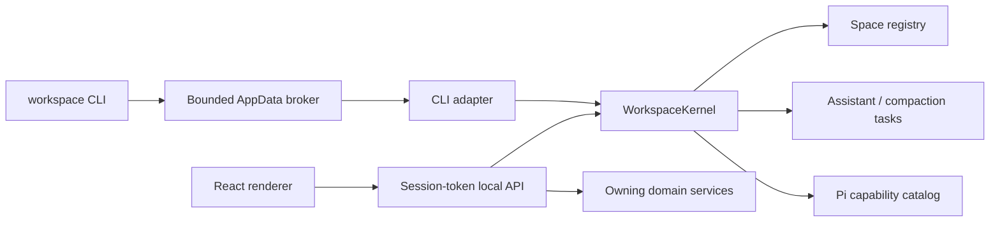
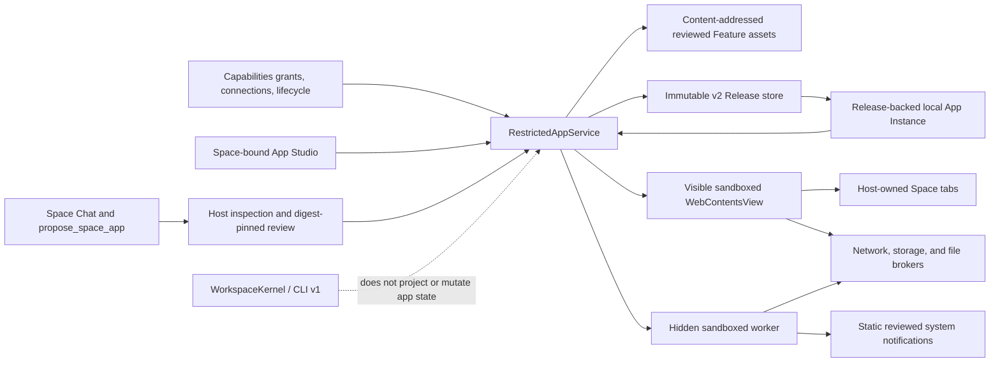

# Architecture

Workspace has three runtime responsibility layers, one shared in-process management plane, and a separate restricted-app execution lane:

1. The React renderer presents a Space selector plus Files, Capabilities, Chats, Library, and History surfaces, with Assistant configuration in Settings.
2. The local Node host owns filesystem access, conversations, resource import, Pi sessions, and the domain services that authorize mutations.
3. Electron supplies native windows, menus, dialogs, secure storage, lifecycle, and packaging.

In the packaged app, the local Node host runs inside Electron's main process; development mode can run it as a separate local process beside Vite. Inside that host, `WorkspaceKernel` is the read-only control plane shared by the local API/renderer and desktop CLI. It resolves actor context and returns versioned Space, task, and capability snapshots. It is not another process, database, public HTTP service, or mutation authority.

The renderer never receives provider secrets or unrestricted filesystem access. Native and filesystem operations cross typed API or preload boundaries.

## Shared management plane

The desktop host creates one `WorkspaceKernel` and passes it to both `startLocalApi` and `WorkspaceCliKernelAdapter`. The packaged renderer/local API and installed CLI therefore share one live registry of Assistant work. Scripts such as `workspace:drive` use the same semantics and code path but normally create their own temporary host unless they attach to an already-running development API; future adapters must be explicit about which host and kernel they observe.

An actor includes its kind and may include a current directory, Space id, or conversation id. Explicit Space id wins; otherwise the deepest registered Space root containing the actor's current directory wins. Snapshots carry a compatibility version and cover context, registered Spaces, running Assistant turns/Chat compactions, and Pi capabilities with packages, trust, provenance, and diagnostics.

The kernel observes and projects domain state; it does not own writes. Renderer mutations still pass through local API handlers, registered-Space authorization, capability-mutation locks, filesystem safety, and History. Assistant turns and compactions register a kernel task at acceptance and finish it in cleanup paths. Capability mutations are rejected while affected work is active.

The public `workspace` command uses a compact adapter that omits content. Its protocol-v1 request/response files live under `%APPDATA%\Workspace\cli`; Electron's single-instance handoff lets a command contact the running app or start a headless host. The channel is bounded and same-user, but not authenticated, so it remains read-only. See [Workspace management layer](management-layer.md) for the full snapshot, adapter, CLI, and security contracts.

## Product model and navigation

**Workspace** is the product. A **Space** is its unit of work: an understandable context for an activity, backed by one ordinary folder. Creating a Space creates a managed folder; turning an existing folder into a Space registers that folder in place. Neither path converts the user's files to an application-specific format.

The Space selector establishes the active root-folder entity; a Space is not itself a peer navigation surface. The primary information architecture is:

- **Files** — the ordinary folder contents of the selected Space.
- **Capabilities** — one Installed/Discover surface for Skills and Extensions, available personally or from a registered Space. Package provenance and lifecycle live here without becoming another top-level concept.
- **Chats** — conversations associated with the selected Space.
- **Library** — reusable personal materials available across Spaces.
- **History** — checkpoints and recoverable changes for the selected Space.

Provider, model, and authentication configuration for the Pi-powered Assistant lives under **Settings → Assistant**.

The concepts have deliberately different scopes and trust levels. Library materials are passive and personal. Skills influence how the Assistant works and may include scripts. Extensions execute code or reach other systems and therefore require stronger, explicit trust. Combining them in one management surface does not collapse those differences: type, provenance, scope, load state, diagnostics, and package contents remain visible. Making something available does not silently activate it or add it to a chat's context.

Surface tabs are Space-bound rather than global views of the currently selected folder. Activating a tab activates its owning Space, and switching Spaces restores that Space's most recent tab. All open Chat panels remain mounted while the window exists; an accepted Pi turn continues in the app-owned local API while its tab is inactive, the window is minimized, the Windows window is hidden to the system tray, or the last macOS window is closed and later recreated from the Dock. Event-stream reconnects use server turn-state snapshots and persisted transcript rehydration so renderer sleep, window recreation, or wake does not lose the result.

Loaded Pi Extensions may contribute a validated declarative surface through a bounded `surface.json` file beside their entry point. The capability catalog carries this metadata to the renderer, which keeps the five primary destinations fixed, places contributed apps in a separate rail region, renders their navigator and content with host-owned components, and opens each view as a Space-bound tab. This contract carries no HTML or executable renderer code. Invalid manifests remain diagnostics on the owning capability. See [Extension surfaces](extension-surfaces.md).

Technical types, routes, and storage paths may continue to use `workspace`, `project`, or `resource` for API stability and compatibility with Pi. User-facing copy should use **Space** for the working context and **Library** for reusable personal materials. Pi's own “resource” terminology remains appropriate when describing Pi runtime discovery rather than the Library.

## Storage

Every Space is backed by an ordinary content folder. Its small portable data layer lives under `.workspace/`: `space.json` carries a stable, versioned identity and `conversations/` carries append-only Chat logs. Workspace reuses a valid manifest id when a moved folder is relinked. Both `.workspace/` and `.pi/` are hidden from the Files surface and excluded from History capture.

Operational state remains outside the folder. Electron user data holds the Space registry, content-addressed History objects, ignore rules, provider credentials, application preferences, and the local App Studio registry/store. App Project presentation, canonical Release envelopes, release-backed App bytes, grants, connections, schedules, operation journals, receipts, retained-data records, and mutable App data are machine-local application state; Workspace 0.4 does not add a portable App Project file. The configured Pi agent directory holds Pi sessions, Pi's own trust store for other native consumers, personal capabilities, and Pi settings. Native Pi project skills, extensions, prompts, settings, and context stay separately under the Space's `.pi/` directory. Workspace's runtime provider authorizes the exact registered root and explicitly denies unregistered roots; it does not rewrite Pi's independent trust store. Removing a linked Space preserves its ordinary files and `.workspace/`; deleting a managed Space removes the managed folder. Removal first persists a machine-local intent and installs a whole-Space runtime fence, then revokes trust and clears App state before final cleanup. Interrupted intents stay hidden and untrusted for startup recovery. Managed deletion atomically claims the exact canonical directory identity under a random transaction-bound same-filesystem path, revalidates and records that claim, and recursively deletes only the claim rather than any later replacement at the registered path. Either removal is blocked while the Space is the source or target of an active release-backed App Instance, so uninstall can make the data disposition explicit first. A source Space is also blocked while its Project owns retained App data. After those obligations are gone, source removal clears that machine-local Project, Development Instance, prepared operations, Releases, and administrative receipts, and marks unreferenced Release objects for safe reconciliation; transient cleanup failure is retried before later App mutations and at startup. Target removal cancels prepared operations aimed at that target.

The Library is application-scoped, reusable across Spaces, and separate from chat context. Copying a Library item into a Space is an explicit action and produces an ordinary file in that Space; Library contents are not automatically attached to conversations or synchronized into every Space.

File change streams retain the logical Space root as the access-policy boundary but pass a `realpath`-canonical root to native `fs.watch`. On Windows this avoids Node/libuv aborts when the same folder is represented once by its long path and once by an 8.3 short path. The watcher fallback remains non-recursive where the host does not support recursive watching.

Folders synchronized by Google Drive for desktop or other desktop sync tools can be turned into Spaces like any other local folder. Native cloud-provider mirroring is a separate feature and should use a provider-neutral adapter with stable remote IDs and explicit conflict handling.

## Space authorization and executable lanes

Creating or registering a Space is the single user action that authorizes Workspace to load executable project configuration from that exact folder. The shared runtime authority is derived from the Space registry, so the renderer, local API, kernel, CLI projection, and Pi sessions cannot drift. Removing the Space revokes Workspace's authorization. Registration is not code review: native Pi Extensions still run with the current user's permissions, and synchronized or source-controlled `.pi` content can change later.

Restricted apps run beside, not inside, the Pi capability catalog and management snapshot:

The trusted renderer supplies app identity, placement rectangles, review and permission UI, and shell tab state. It does not execute package JavaScript. Electron main owns installed-revision verification, sandbox creation, sender-to-owner binding, generation-aware lifecycle, brokers, credential injection, and teardown. Package JavaScript sees only the frozen `workspaceRestrictedApp` bridge appropriate to its visible or worker lifecycle.

Agent-created restricted apps use a separate package contract. Workspace parses version-2 `agent-app.json`, validates a reviewed HTML entry, an optional worker, bounded tool schemas, exact public-HTTPS or numeric-loopback targets, reviewed Space-file needs, static notification categories, and named interval automations with exact permission subsets; it rejects native-Pi execution fields and linked or oversized files and stages a reviewed content digest without importing JavaScript. A host-owned Pi tool can turn a completed Space-relative package into a persisted, owning-Chat-bound review receipt; the tool cannot add a preview, grant access, enable jobs, or collect credentials. Its direct preview path creates a Local preview in a Development Instance. Visible UI runs in an ephemeral sandboxed `WebContentsView` with sender-bound context, tab, network, bounded storage, storage-invalidation, and file bridges, while Assistant actions and automations use a separate hidden sandbox. A machine-wide in-process scheduler outside management protocol v1 coordinates all Space-app jobs with two active slots, FIFO admission, same-job non-overlap, durable cadence/catch-up state, and run receipts. System notifications are host-owned, separately granted, static-copy, enabled-automation-only, and rate-limited. File writes are grant-relative, atomic, and History-covered. Public OAuth PKCE is host-owned and encrypted. Apps own a Space rail navigator and may request normal persistent, Space-owned right tabs; the host derives identity and shell tab ids. Proposal, preview addition, Release preparation, local publication, App Instance installation, destination/file/notification grants, connections, every automation enablement, update activation, and uninstall data disposition remain separate. These packages never enter Pi's loaded Extension catalog. See [Restricted app runtime](restricted-app-runtime.md) for shipped behavior and [App platform foundation](app-platform-foundation.md) for the Project/Release/Instance model.

The local App-platform foundation resolves that compatibility surface into
explicit Project, Development Instance, Feature Installation, Data Namespace,
Tenant, Principal, artifact-digest, and seven-domain authority records. Storage
uses Tenant + Data Namespace ownership. Connections bind Tenant, Runtime
Instance, Feature Installation and revision, exact declaration and target, and
the current Runtime Instance owner; the portable contract models future
Principal-owned consent separately. Authority is fenced again immediately before
external fetches and atomic storage or Space-file effects.

The platform now drives App Studio through a strict offline multi-Feature
Release assembler/verifier, a durable content-addressed Release store, and a
side-effect-free local App Instance update planner. Release format version 2
includes a bounded App presentation snapshot; its digest closes canonical
records plus every referenced artifact byte. Review, signature, and
registry-policy sidecars remain outside that digest. Preparing a Release stores
the verified canonical envelope and a local prepared record; publishing is a
separate state transition that rechecks the source preview stamps and does not
contact a server. The store applies a four-GiB aggregate byte quota before each
new content-addressed put. Startup performs one bounded full verification pass,
uses compact verified projections for registry/install integrity, and only then
prunes unreferenced objects. Explicit Release deletion is denied while an active
Instance, a prepared operation's source or target, or retained data requires the
digest; registry removal commits before restart-retried physical pruning.

Install and update preparation persist operation ids, target Space, exact
Release digest, Runtime Instance identity, new Feature/Data allocations, and the
deterministic update plan before activation. Source and target capability
mutation locks prevent concurrent Assistant/capability work in either affected
Space. Activation re-reads the published envelope, rechecks target Feature-id
collisions or the active Release pointer, recomputes the plan, stages verified
Feature packages, stops predecessor hosts, and exposes the transition only
through one registry commit. One `(projectId, target Space)` instance is allowed.
The current local runtime rejects schema-bearing Features and migrations, so its
data decision is retain rather than an unimplemented migration.

Registry commits also persist idempotent cleanup obligations before old
credentials, data, or package bytes become unreachable, and startup retries
unfinished cleanup. New automation receipts capture the accepting local
Tenant, Runtime Instance, Feature Installation, canonical Feature Revision,
Data Namespace, effective Principal, seven-domain authority, occurrence, and
attempt. Acceptance is persisted before worker execution in an
installation-independent ledger and terminalized by run id after update or
removal. Startup reconciles an accepted run whose worker result was lost to an
explicit `interrupted`/`expired` receipt that says its external-effect outcome
is unknown; migrated receipts stay explicitly legacy-unverified.

Whole-instance uninstall removes live runtime and connection authority and
requires a retain-or-purge choice for every Feature Data Namespace. Retained
namespaces are recorded without an installation and can be purged later;
retained-data adoption and export are not implemented. Source and target Space
removal are blocked while an App Instance remains active so neither path can
silently choose this lifecycle outcome. The source remains blocked until any
retained namespaces are explicitly purged; a target may be removed after
uninstall because the retained namespace stays owned by its source Project.

A separate private-hosted semantic core exercises the same object and authority
model through injected durable CAS-state, job/lease, vault, and effect-broker
interfaces. It proves authenticated Project/cloud-Project and Tenant separation,
closed Release review/publication/deployment, role-aware data, connection and job
revocation, compatible update, receipts, export, deletion, and cleanup recovery.
It is executable contract evidence, not a shipped cloud service: production
persistence, scheduling workers, vault, egress, transport, deployment,
operations, and UI adapters are intentionally absent.

## Packaging

The packaged app contains the compiled Electron/local API runtime, renderer, Pi production dependencies, neutral icons, and external CLI shims. The shims remain outside `app.asar` while Electron keeps the `RunAsNode`, Node options, and CLI inspect fuses disabled and validates embedded ASAR integrity.

Electron Builder is the canonical packager on both supported desktop lanes. The Windows unpacked smoke verifies ASAR paths, CLI assets, and fuses but intentionally has no `resources/app-update.yml`; the NSIS release lane creates the installer, blockmap, public `latest.yml`, and embedded feed together. The macOS structural lane creates an ad hoc signed `Workspace Local Smoke.app`, DMG, ZIP, both blockmaps, `latest-mac.yml`, and checksums, then verifies the bundle, fuses, packaged JXA CLI helper, and mounted image. The local smoke has a distinct bundle id, build channel and application-data directory, and its runtime never starts the production updater. Developer ID signing, notarization, and production-identity interactive testing are a separate release mode.

On Windows 11 22H2 or newer, Electron may use Mica when reduced transparency is not requested. The preload reports the selected material before React renders so root chrome can become transparent without a first-paint flash; content surfaces remain opaque. Older Windows builds and reduced-transparency sessions use theme-matched solid backgrounds.

macOS uses a hidden-inset native title bar with traffic lights and native application/File/Edit/View/Window/Help menus. Sidebar vibrancy is limited to structural chrome when reduced transparency is off; content surfaces remain opaque and use a theme-matched solid fallback. Packaged child processes inherit `Workspace.app/Contents/bin` so the Mac protocol-v1 CLI can address the exact app without changing a shell profile.

`desktop:prepare` runs the production renderer and Electron compile, native Pi preflight, and a real-Electron restricted-app probe that exercises both sandbox hosts and their lifecycle denial. The package does not contain a bundled document library, private Skill catalog, provider key, or signing material. See [Windows build](windows-build.md), [Windows releases and signing](windows-release.md), and [macOS build and release lane](macos-build.md) for verification and publishing.
