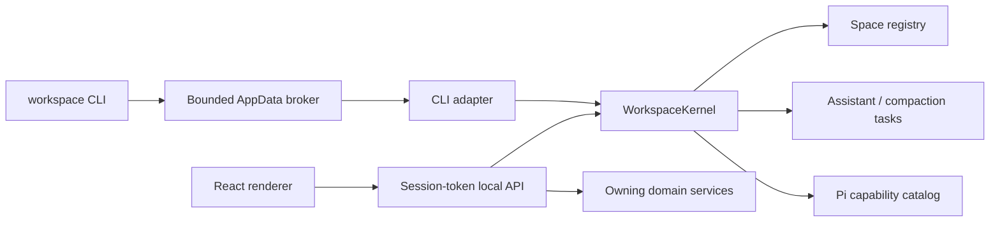

# Architecture

Workspace has three runtime responsibility layers and one shared in-process management plane:

1. The React renderer presents a Space selector plus Files, Capabilities, Chats, Library, and History surfaces, with Assistant configuration in Settings.
2. The local Node host owns filesystem access, conversations, resource import, Pi sessions, and the domain services that authorize mutations.
3. Electron supplies native windows, menus, dialogs, secure storage, lifecycle, and packaging.

In the packaged app, the local Node host runs inside Electron's main process; development mode can run it as a separate local process beside Vite. Inside that host, `WorkspaceKernel` is the read-only control plane shared by the local API/renderer and desktop CLI. It resolves actor context and returns versioned Space, task, and capability snapshots. It is not another process, database, public HTTP service, or mutation authority.

The renderer never receives provider secrets or unrestricted filesystem access. Native and filesystem operations cross typed API or preload boundaries.

## Shared management plane

The desktop host creates one `WorkspaceKernel` and passes it to both `startLocalApi` and `WorkspaceCliKernelAdapter`. The packaged renderer/local API and installed CLI therefore share one live registry of Assistant work. Scripts such as `workspace:drive` use the same semantics and code path but normally create their own temporary host unless they attach to an already-running development API; future adapters must be explicit about which host and kernel they observe.

An actor includes its kind and may include a current directory, Space id, or conversation id. Explicit Space id wins; otherwise the deepest registered Space root containing the actor's current directory wins. Snapshots carry a compatibility version and cover context, registered Spaces, running Assistant turns/Chat compactions, and Pi capabilities with packages, trust, provenance, and diagnostics.

The kernel observes and projects domain state; it does not own writes. Renderer mutations still pass through local API handlers, registered-Space authorization, capability-mutation locks, filesystem safety, and History. Assistant turns and compactions register a kernel task at acceptance and finish it in cleanup paths. Capability mutations are rejected while affected work is active.

The public `workspace` command uses a compact adapter that omits content. Its protocol-v1 request/response files live under `%APPDATA%\Workspace\cli`; Electron's single-instance handoff lets a command contact the running app or start a headless host. The channel is bounded and same-user, but not authenticated, so it remains read-only. See [Workspace management layer](management-layer.md) for the full snapshot, adapter, CLI, and security contracts.

## Product model and navigation

**Workspace** is the product. A **Space** is its unit of work: an understandable context for an activity, backed by one ordinary folder. Creating a Space creates a managed folder; turning an existing folder into a Space registers that folder in place. Neither path converts the user's files to an application-specific format.

The Space selector establishes the active root-folder entity; a Space is not itself a peer navigation surface. The primary information architecture is:

- **Files** — the ordinary folder contents of the selected Space.
- **Capabilities** — one Installed/Discover surface for Skills and Extensions, available personally or from a registered Space. Package provenance and lifecycle live here without becoming another top-level concept.
- **Chats** — conversations associated with the selected Space.
- **Library** — reusable personal materials available across Spaces.
- **History** — checkpoints and recoverable changes for the selected Space.

Provider, model, and authentication configuration for the Pi-powered Assistant lives under **Settings → Assistant**.

The concepts have deliberately different scopes and trust levels. Library materials are passive and personal. Skills influence how the Assistant works and may include scripts. Extensions execute code or reach other systems and therefore require stronger, explicit trust. Combining them in one management surface does not collapse those differences: type, provenance, scope, load state, diagnostics, and package contents remain visible. Making something available does not silently activate it or add it to a chat's context.

Surface tabs are Space-bound rather than global views of the currently selected folder. Activating a tab activates its owning Space, and switching Spaces restores that Space's most recent tab. All open Chat panels remain mounted; an accepted Pi turn continues in the local API while its tab is inactive, the window is minimized, or the window is hidden to the system tray. Event-stream reconnects use server turn-state snapshots and persisted transcript rehydration so renderer sleep or wake does not lose the result.

Loaded Pi Extensions may contribute a validated declarative surface through a bounded `surface.json` file beside their entry point. The capability catalog carries this metadata to the renderer, which keeps the five primary destinations fixed, places contributed apps in a separate rail region, renders their navigator and content with host-owned components, and opens each view as a Space-bound tab. This contract carries no HTML or executable renderer code. Invalid manifests remain diagnostics on the owning capability. See [Extension surfaces](extension-surfaces.md).

Technical types, routes, and storage paths may continue to use `workspace`, `project`, or `resource` for API stability and compatibility with Pi. User-facing copy should use **Space** for the working context and **Library** for reusable personal materials. Pi's own “resource” terminology remains appropriate when describing Pi runtime discovery rather than the Library.

## Storage

Every Space is backed by an ordinary content folder. Its small portable data layer lives under `.workspace/`: `space.json` carries a stable, versioned identity and `conversations/` carries append-only Chat logs. Workspace reuses a valid manifest id when a moved folder is relinked. Both `.workspace/` and `.pi/` are hidden from the Files surface and excluded from History capture.

Operational state remains outside the folder. Electron user data holds the Space registry, content-addressed History objects, ignore rules, provider credentials, and application preferences. The configured Pi agent directory holds Pi sessions, Pi's own trust store for other native consumers, personal capabilities, and Pi settings. Native Pi project skills, extensions, prompts, settings, and context stay separately under the Space's `.pi/` directory. Workspace's runtime provider authorizes the exact registered root and explicitly denies unregistered roots; it does not rewrite Pi's independent trust store. Removing a linked Space deletes its external Workspace operational state but preserves `.workspace/`; deleting a managed Space removes the whole managed folder.

The Library is application-scoped, reusable across Spaces, and separate from chat context. Copying a Library item into a Space is an explicit action and produces an ordinary file in that Space; Library contents are not automatically attached to conversations or synchronized into every Space.

File change streams retain the logical Space root as the access-policy boundary but pass a `realpath`-canonical root to native `fs.watch`. On Windows this avoids Node/libuv aborts when the same folder is represented once by its long path and once by an 8.3 short path. The watcher fallback remains non-recursive where the host does not support recursive watching.

Folders synchronized by Google Drive for desktop or other desktop sync tools can be turned into Spaces like any other local folder. Native cloud-provider mirroring is a separate feature and should use a provider-neutral adapter with stable remote IDs and explicit conflict handling.

## Space authorization and executable lanes

Creating or registering a Space is the single user action that authorizes Workspace to load executable project configuration from that exact folder. The shared runtime authority is derived from the Space registry, so the renderer, local API, kernel, CLI projection, and Pi sessions cannot drift. Removing the Space revokes Workspace's authorization. Registration is not code review: native Pi Extensions still run with the current user's permissions, and synchronized or source-controlled `.pi` content can change later.

Agent-created restricted apps use a separate package contract. Workspace parses `agent-app.json`, validates a reviewed HTML entry, optional Assistant/background worker, bounded tool schemas, exact public-HTTPS or numeric-loopback targets, reviewed Space-file needs, and an optional background interval; it rejects native-Pi execution fields and linked or oversized files and installs a reviewed content digest without importing JavaScript. A host-owned Pi tool can turn a completed Space-relative package into a persisted, owning-Chat-bound review receipt; the tool cannot install, grant access, or collect credentials. Visible UI runs in an ephemeral sandboxed `WebContentsView` with sender-bound context, tab, network, bounded storage, and file bridges, while optional Assistant/background work uses a separate hidden sandbox. File writes are grant-relative, atomic, and History-covered. Public OAuth PKCE is host-owned and encrypted. Apps own a Space rail navigator and may request normal persistent, Space-owned right tabs; the host derives identity and shell tab ids. Proposal, installation, destination/file grants, connections, and background enablement remain separate. These packages never enter Pi's loaded Extension catalog. See [Restricted app runtime](restricted-app-runtime.md).

## Packaging

The packaged app contains the compiled Electron/local API runtime, renderer, Pi production dependencies, neutral icons, and external CLI shims. The shims remain outside `app.asar` while Electron keeps the `RunAsNode`, Node options, and CLI inspect fuses disabled and validates embedded ASAR integrity.

Electron Builder is the canonical Windows release packager. An unpacked smoke package verifies ASAR paths, CLI assets, and fuses, but intentionally has no `resources/app-update.yml`; updater controls stay disabled in that lane. The NSIS release lane creates the installer, blockmap, public `latest.yml`, and embedded feed together.

On Windows 11 22H2 or newer, Electron may use Mica when reduced transparency is not requested. The preload reports the selected material before React renders so root chrome can become transparent without a first-paint flash; content surfaces remain opaque. Older Windows builds and reduced-transparency sessions use theme-matched solid backgrounds.

The package does not contain a bundled document library, private Skill catalog, provider key, or signing material. See [Windows build](windows-build.md) and [Windows releases and signing](windows-release.md) for verification and publishing.
