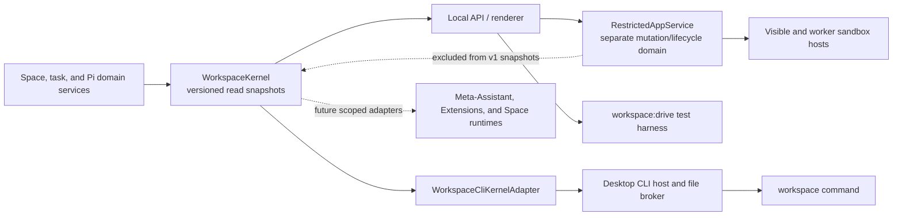

# Workspace management layer

Workspace now has a small management layer over its existing product model. It gives the renderer, command line, test harnesses, and future Assistant-facing adapters one semantic view of Spaces, running work, and Pi capabilities without creating another data store or agent framework.

This is infrastructure, not another rail item. **Workspace**, **Space**, **Files**, **Chats**, **Library**, **History**, and **Capabilities** remain the user-facing nouns. The management layer makes those nouns inspectable in a consistent, versioned form.

## Why it exists

The desktop UI already knows how to work with Spaces and Pi, but a higher-level Assistant, an Extension, a script, or a future Space runtime also needs answers to basic questions:

- Which Space applies to this actor and working directory?
- Which Spaces are registered?
- Which Assistant turns or Chat compactions are still running?
- Which Skills, Extensions, tools, packages, prompts, themes, and commands are available in this Space, and what are their scope, source, trust, and load states?

Those answers should not be reimplemented by every consumer. `WorkspaceKernel` is the shared in-process read authority that produces them.



Domain services still own writes. The kernel does not bypass folder grants, registered-Space authorization, capability-mutation locks, History behavior, or any other mutation policy.

The dotted restricted-app edge is a boundary, not a data flow into the kernel. Space apps have their own reviewed package, grant, encrypted connection, storage, background, notification, and sandbox-host state. Protocol v1 and `workspace.capabilities` intentionally do not list or mutate that state. Future app inventory belongs in a deliberately versioned kernel snapshot only after its content and authorization contract are designed.

## Kernel contract

`src/local/workspace-kernel.ts` defines `workspaceKernelSnapshotVersion` and a normalized actor context:

```ts
interface WorkspaceActor {
  kind: "human" | "assistant" | "cli" | "renderer" | "extension" | "app" | "system";
  cwd?: string;
  workspaceId?: string;
  conversationId?: string;
}
```

Space resolution is deterministic:

1. An explicit `workspaceId` wins.
2. Otherwise, the most-specific registered Space whose root contains `cwd` wins. This matters when registered Space roots are nested.
3. Otherwise, the result has no Space context.

The current snapshot version is `1` and exposes four read models:

| Snapshot | What it contains |
|---|---|
| `workspace.context` | Normalized actor, resolution method, and resolved Space or `null`. |
| `workspace.spaces` | Registered Space identities, roots, ownership/location metadata, and timestamps. |
| `workspace.tasks` | Running `assistant_turn` and `compaction` records, optionally scoped to one Space. |
| `workspace.capabilities` | Pi's authoritative capability catalog plus packages, project authorization, mutation eligibility, provenance, and diagnostics for one Space. |

The local API and the desktop CLI share one kernel instance. Assistant turns and Chat compactions register a task when work is accepted and finish it in success and failure cleanup paths. Capability mutations remain blocked while affected work is active, so a catalog reload cannot silently terminate a background turn.

Capability snapshots are projections of Pi's native catalog. They do not create a second full-trust registry, activate inactive tools, bypass the Space registry, or install anything.

## Workspace CLI

The Windows installer places `workspace.cmd`, an extensionless `workspace` shim, and the private `workspace-cli.ps1` helper in `<install>\bin`, then adds that directory to the current user's `PATH`. Open a new terminal after installation if an existing shell has not picked up the environment change.

```powershell
workspace context --json
workspace spaces list
workspace tasks list --space "Personal Space"
workspace capabilities list --space "Personal Space" --json
workspace version
workspace help capabilities
```

`--space <id-or-exact-name>` selects a Space explicitly. Without it, Space-aware commands resolve the terminal's current working directory. Duplicate exact names are rejected as ambiguous; use the stable Space id in automation. `--json` emits the stable protocol projection and is the preferred interface for scripts, Codex, Claude Code, and other shell-capable harnesses.

The current CLI is intentionally content-free and read-only. It returns Space names and paths, task metadata, and capability metadata; it does not return file contents, conversation text, credentials, or provider tokens.

## Desktop handoff

The public command does not run Electron as Node; the `RunAsNode` fuse remains disabled. Instead it uses a bounded protocol-v1 file handoff:

1. The shim writes an atomic UUID-named request beneath `%APPDATA%\Workspace\cli\requests` containing the arguments, current working directory, protocol version, and timestamp.
2. It starts or contacts the exact installed `Workspace.exe` with that request id. Electron's single-instance handoff routes the request to the existing desktop host when the app is already open.
3. The desktop host claims and serializes the request, executes it through `WorkspaceCliKernelAdapter`, and atomically writes stdout, stderr, structured result, and exit code beneath `responses`.
4. The shim returns that output and removes its request and response files. The broker also removes stale bounded files during initialization.

A CLI-only launch can initialize the host, process its queue, flush Pi state, and exit without showing the interactive window. If the GUI is already running, the command uses the same kernel and live task registry as the renderer.

The broker rejects unsafe roots, symbolic-link or non-regular request files, path escapes, oversized payloads, stale timestamps, future clock skew, duplicate claims, and unsupported fields. These checks make the handoff bounded; they do not authenticate the caller.

## Security boundary

`%APPDATA%\Workspace\cli` is a same-Windows-user coordination channel, not a public API or authenticated caller boundary. Another process running as the same user may be able to submit requests and read the resulting local metadata. Protocol v1 therefore remains read-only.

Do not add mutations to protocol v1. A future write surface needs, at minimum:

- authenticated caller identity and per-action authorization;
- explicit Personal, Space, and Chat scopes;
- request freshness and replay protection;
- confirmation and revocation behavior for sensitive operations;
- durable receipts or audit records for accepted changes;
- the existing Space-registration, concurrency, History, and filesystem-policy checks.

## Agent harness versus management CLI

The management CLI inspects the running product. `workspace:drive` serves a different purpose: it runs one real Pi turn through the same local API, built-in tools, Skills, Extensions, persistence, and event stream as the desktop app.

```powershell
npm run workspace:drive -- --workspace C:\path\to\space --prompt "Summarize the files in this Space"
npm run workspace:drive -- --workspace C:\path\to\space --prompt "..." --json --agent-dir C:\temp\isolated-pi
npm run workspace:drive -- --workspace-id <id> --attach http://127.0.0.1:4327 --prompt "..."
```

Useful options include `--prompt-file`, repeatable `--context`, `--conversation`, `--attach`, `--agent-dir`, `--timeout`, `--json`, and `--quiet`. In-process runs use temporary Workspace application state unless `WORKSPACE_STATE_DIR` is set. Provider credentials still come from Pi auth storage or standard provider environment variables.

Use the CLI to assert management snapshots. Use `workspace:drive` to test actual Assistant behavior end to end.

## Direction, not shipped authority

This read-only layer is the first primitive for a broader Workspace operating layer. It can support a future cross-Space Assistant and controlled Space runtimes because they can start from one semantic inventory instead of scraping UI state.

The renderer capability catalog now also carries validated declarative surface metadata from Extensions Pi actually loaded. The compact installed CLI projection remains content-free and does not emit surface block contents or mutate UI state.

Separately, the local restricted-app service can inspect and install completed reviewed web assets without evaluation, and the desktop can mount or invoke them through the sandbox hosts. Package dependency metadata is never resolved or installed. Restricted apps remain outside the kernel and CLI projection and must never be merged into Pi's loaded Extension catalog. See [Restricted app runtime](restricted-app-runtime.md).

It does **not** yet provide:

- an authenticated mutation API;
- a cross-Space meta-Assistant with delegated authority;
- event subscriptions for all state changes;
- imperative APIs for full-trust Pi Extensions to dynamically create or mutate rail items, panes, or tabs beyond the static `surface.json` contribution contract (restricted Space apps already have their separate host-owned navigator and tab bridge);
- a verified registry that binds a Space-local service to a Workspace-launched process generation;
- host-owned remote subscriptions or arbitrary push adapters for restricted
  apps (static reviewed background notifications are already supported);
- resource isolation comparable to a mobile operating system; the shipped Chromium hosts and brokers do not eliminate renderer exploits or CPU/memory denial-of-service risk.

Restricted apps already have an explicit package, permission, lifecycle, sandbox-host, connection, storage, file-grant, background-work, and UI-surface model. The remaining features should extend those contracts and the kernel's read authority instead of reaching around either boundary.

## Implementation and verification map

| Area | Source | Primary tests |
|---|---|---|
| Versioned snapshots and context resolution | `src/local/workspace-kernel.ts` | `tests/workspace-kernel.test.ts` |
| Compact CLI projection | `src/local/workspace-cli-adapter.ts` | `tests/workspace-cli-adapter.test.ts` |
| Protocol, parsing, output, and exit codes | `src/local/cli/protocol.ts`, `src/local/cli/commands.ts` | `tests/workspace-cli-protocol.test.ts` |
| Atomic bounded file broker | `src/local/cli/broker.ts` | `tests/workspace-cli-broker.test.ts` |
| Electron single-instance host | `desktop/src/cli-host.ts`, `desktop/src/main.ts` | `tests/desktop-cli-host.test.ts` |
| Installer shims and PATH integration | `desktop/cli/`, `desktop/nsis/cli-path.nsh` | `tests/desktop-cli-packaging.test.ts` |
| Real Pi turn driver | `scripts/workspace-drive.ts` | Exercised against the local API when provider credentials are available. |
| Restricted app review, grants, lifecycle, and storage | `src/local/agent/restricted-app-*.ts` | `tests/restricted-app-*.test.ts` |
| Visible and worker sandbox hosts | `desktop/src/restricted-app-host.ts`, `desktop/src/restricted-app-preload.cts` | `npm run desktop:restricted-app:smoke` plus focused host/broker tests. |

See [Architecture](architecture.md) for the surrounding process boundaries, [Product model](product-model.md) for the user-facing mental model, and [Windows build](windows-build.md) for packaging and release verification.
